Survival Analysis Final Project – Exploratory Data Analysis
================
Jing Lyu
2025-12-04

- [Introduction](#introduction)
- [Data and Variables](#data-and-variables)
  - [Data source](#data-source)
  - [Variable description](#variable-description)
- [Descriptive Statistics](#descriptive-statistics)
  - [Overall summary](#overall-summary)
  - [Characteristics by survival
    status](#characteristics-by-survival-status)
- [Distribution of Key Variables](#distribution-of-key-variables)
  - [Continuous variables](#continuous-variables)
  - [Categorical variables](#categorical-variables)
- [Univariate Survival Exploration: Kaplan–Meier
  Curves](#univariate-survival-exploration-kaplanmeier-curves)
  - [KM curves for binary clinical
    variables](#km-curves-for-binary-clinical-variables)
    - [Sex](#sex)
    - [Anaemia](#anaemia)
    - [Diabetes](#diabetes)
    - [High blood pressure](#high-blood-pressure)
    - [Smoking](#smoking)
  - [KM curves for grouped continuous
    variables](#km-curves-for-grouped-continuous-variables)
    - [Age groups](#age-groups)
    - [Ejection fraction groups](#ejection-fraction-groups)
    - [Serum creatinine groups](#serum-creatinine-groups)
    - [Serum sodium groups](#serum-sodium-groups)
- [Summary of EDA Findings](#summary-of-eda-findings)

# Introduction

This report presents the exploratory data analysis (EDA) for the
survival analysis project on heart failure patients.

The aim of this EDA is to:

- Describe the distribution of demographic and clinical variables;
- Compare characteristics between patients who died and those who
  survived (censored);
- Explore univariate survival patterns using Kaplan–Meier (KM) curves
  and log-rank tests for key predictors.

The results from this EDA will inform later multivariable modelling
(e.g., Cox proportional hazards model and Random Survival Forest).

# Data and Variables

## Data source

The dataset contains 299 heart failure patients and was collected in
Pakistan over a follow-up period of up to 9 months.  
Each row corresponds to one patient.

``` r
# NOTE: Change the file name / path if needed
# Common Kaggle filename: "heart_failure_clinical_records_dataset.csv"

heart <- read.csv("heart_failure_clinical_records_dataset.csv")

# Quick check of structure
str(heart)
```

    ## 'data.frame':    299 obs. of  13 variables:
    ##  $ age                     : num  75 55 65 50 65 90 75 60 65 80 ...
    ##  $ anaemia                 : int  0 0 0 1 1 1 1 1 0 1 ...
    ##  $ creatinine_phosphokinase: int  582 7861 146 111 160 47 246 315 157 123 ...
    ##  $ diabetes                : int  0 0 0 0 1 0 0 1 0 0 ...
    ##  $ ejection_fraction       : int  20 38 20 20 20 40 15 60 65 35 ...
    ##  $ high_blood_pressure     : int  1 0 0 0 0 1 0 0 0 1 ...
    ##  $ platelets               : num  265000 263358 162000 210000 327000 ...
    ##  $ serum_creatinine        : num  1.9 1.1 1.3 1.9 2.7 2.1 1.2 1.1 1.5 9.4 ...
    ##  $ serum_sodium            : int  130 136 129 137 116 132 137 131 138 133 ...
    ##  $ sex                     : int  1 1 1 1 0 1 1 1 0 1 ...
    ##  $ smoking                 : int  0 0 1 0 0 1 0 1 0 1 ...
    ##  $ time                    : int  4 6 7 7 8 8 10 10 10 10 ...
    ##  $ DEATH_EVENT             : int  1 1 1 1 1 1 1 1 1 1 ...

``` r
summary(heart)
```

    ##       age           anaemia       creatinine_phosphokinase    diabetes     
    ##  Min.   :40.00   Min.   :0.0000   Min.   :  23.0           Min.   :0.0000  
    ##  1st Qu.:51.00   1st Qu.:0.0000   1st Qu.: 116.5           1st Qu.:0.0000  
    ##  Median :60.00   Median :0.0000   Median : 250.0           Median :0.0000  
    ##  Mean   :60.83   Mean   :0.4314   Mean   : 581.8           Mean   :0.4181  
    ##  3rd Qu.:70.00   3rd Qu.:1.0000   3rd Qu.: 582.0           3rd Qu.:1.0000  
    ##  Max.   :95.00   Max.   :1.0000   Max.   :7861.0           Max.   :1.0000  
    ##  ejection_fraction high_blood_pressure   platelets      serum_creatinine
    ##  Min.   :14.00     Min.   :0.0000      Min.   : 25100   Min.   :0.500   
    ##  1st Qu.:30.00     1st Qu.:0.0000      1st Qu.:212500   1st Qu.:0.900   
    ##  Median :38.00     Median :0.0000      Median :262000   Median :1.100   
    ##  Mean   :38.08     Mean   :0.3512      Mean   :263358   Mean   :1.394   
    ##  3rd Qu.:45.00     3rd Qu.:1.0000      3rd Qu.:303500   3rd Qu.:1.400   
    ##  Max.   :80.00     Max.   :1.0000      Max.   :850000   Max.   :9.400   
    ##   serum_sodium        sex            smoking            time      
    ##  Min.   :113.0   Min.   :0.0000   Min.   :0.0000   Min.   :  4.0  
    ##  1st Qu.:134.0   1st Qu.:0.0000   1st Qu.:0.0000   1st Qu.: 73.0  
    ##  Median :137.0   Median :1.0000   Median :0.0000   Median :115.0  
    ##  Mean   :136.6   Mean   :0.6488   Mean   :0.3211   Mean   :130.3  
    ##  3rd Qu.:140.0   3rd Qu.:1.0000   3rd Qu.:1.0000   3rd Qu.:203.0  
    ##  Max.   :148.0   Max.   :1.0000   Max.   :1.0000   Max.   :285.0  
    ##   DEATH_EVENT    
    ##  Min.   :0.0000  
    ##  1st Qu.:0.0000  
    ##  Median :0.0000  
    ##  Mean   :0.3211  
    ##  3rd Qu.:1.0000  
    ##  Max.   :1.0000

## Variable description

The key variables used in this EDA are:

- **time**: follow-up time (days)  
- **DEATH_EVENT**: death indicator (1 = died during follow-up, 0 =
  censored / alive)

Clinical and demographic predictors:

- **age**: age (years)  
- **anaemia**: anaemia (1 = yes, 0 = no)  
- **creatinine_phosphokinase**: CPK enzyme level (mcg/L)  
- **diabetes**: diabetes (1 = yes, 0 = no)  
- **ejection_fraction**: percentage of blood leaving the heart at each
  contraction (%)  
- **high_blood_pressure**: high blood pressure (1 = yes, 0 = no)  
- **platelets**: platelets (kiloplatelets/mL)  
- **serum_creatinine**: serum creatinine (mg/dL)  
- **serum_sodium**: serum sodium (mEq/L)  
- **sex**: sex (1 = male, 0 = female)  
- **smoking**: smoking (1 = yes, 0 = no)

For convenience in plots and tables, we convert several binary variables
to factors with labels.

``` r
heart <- heart %>%
  mutate(
    DEATH_EVENT   = factor(DEATH_EVENT, levels = c(0, 1), labels = c("Alive/Censored", "Died")),
    anaemia       = factor(anaemia, levels = c(0, 1), labels = c("No", "Yes")),
    diabetes      = factor(diabetes, levels = c(0, 1), labels = c("No", "Yes")),
    high_blood_pressure = factor(high_blood_pressure, levels = c(0, 1), labels = c("No", "Yes")),
    sex           = factor(sex, levels = c(0, 1), labels = c("Female", "Male")),
    smoking       = factor(smoking, levels = c(0, 1), labels = c("No", "Yes"))
  )

str(heart)
```

    ## 'data.frame':    299 obs. of  13 variables:
    ##  $ age                     : num  75 55 65 50 65 90 75 60 65 80 ...
    ##  $ anaemia                 : Factor w/ 2 levels "No","Yes": 1 1 1 2 2 2 2 2 1 2 ...
    ##  $ creatinine_phosphokinase: int  582 7861 146 111 160 47 246 315 157 123 ...
    ##  $ diabetes                : Factor w/ 2 levels "No","Yes": 1 1 1 1 2 1 1 2 1 1 ...
    ##  $ ejection_fraction       : int  20 38 20 20 20 40 15 60 65 35 ...
    ##  $ high_blood_pressure     : Factor w/ 2 levels "No","Yes": 2 1 1 1 1 2 1 1 1 2 ...
    ##  $ platelets               : num  265000 263358 162000 210000 327000 ...
    ##  $ serum_creatinine        : num  1.9 1.1 1.3 1.9 2.7 2.1 1.2 1.1 1.5 9.4 ...
    ##  $ serum_sodium            : int  130 136 129 137 116 132 137 131 138 133 ...
    ##  $ sex                     : Factor w/ 2 levels "Female","Male": 2 2 2 2 1 2 2 2 1 2 ...
    ##  $ smoking                 : Factor w/ 2 levels "No","Yes": 1 1 2 1 1 2 1 2 1 2 ...
    ##  $ time                    : int  4 6 7 7 8 8 10 10 10 10 ...
    ##  $ DEATH_EVENT             : Factor w/ 2 levels "Alive/Censored",..: 2 2 2 2 2 2 2 2 2 2 ...

# Descriptive Statistics

## Overall summary

We first summarize all variables in the full cohort.

``` r
# Define continuous and categorical variables
cont_vars <- c("age", "creatinine_phosphokinase", "ejection_fraction",
               "platelets", "serum_creatinine", "serum_sodium", "time")

cat_vars  <- c("sex", "anaemia", "diabetes",
               "high_blood_pressure", "smoking", "DEATH_EVENT")

# Optional: nicer labels for variables
var_labels <- list(
  age                      = "Age (years)",
  creatinine_phosphokinase = "Creatinine phosphokinase (mcg/L)",
  ejection_fraction        = "Ejection fraction (%)",
  platelets                = "Platelets (kiloplatelets/mL)",
  serum_creatinine         = "Serum creatinine (mg/dL)",
  serum_sodium             = "Serum sodium (mEq/L)",
  time                     = "Follow-up time (days)",
  sex                      = "Sex",
  anaemia                  = "Anaemia",
  diabetes                 = "Diabetes",
  high_blood_pressure      = "High blood pressure",
  smoking                  = "Smoking",
  DEATH_EVENT              = "Death during follow-up"
)

table1_gtsum <-
  heart |>
  dplyr::select(all_of(c(cont_vars, cat_vars))) |>
  tbl_summary(
    # 不分组 → 总体描述
    by = NULL,
    label = var_labels,
    # 连续变量统计方式
    type = list(all_continuous() ~ "continuous2"),
    statistic = list(
      all_continuous2() ~ c("{mean} ({sd})", "{median} ({p25}, {p75})")
    ),
    missing = "ifany"
  ) |>
  modify_header(label ~ "**Variable**") |>
  bold_labels()

table1_gtsum
```

<div id="ohaedrdmti" style="padding-left:0px;padding-right:0px;padding-top:10px;padding-bottom:10px;overflow-x:auto;overflow-y:auto;width:auto;height:auto;">
<style>#ohaedrdmti table {
  font-family: system-ui, 'Segoe UI', Roboto, Helvetica, Arial, sans-serif, 'Apple Color Emoji', 'Segoe UI Emoji', 'Segoe UI Symbol', 'Noto Color Emoji';
  -webkit-font-smoothing: antialiased;
  -moz-osx-font-smoothing: grayscale;
}
&#10;#ohaedrdmti thead, #ohaedrdmti tbody, #ohaedrdmti tfoot, #ohaedrdmti tr, #ohaedrdmti td, #ohaedrdmti th {
  border-style: none;
}
&#10;#ohaedrdmti p {
  margin: 0;
  padding: 0;
}
&#10;#ohaedrdmti .gt_table {
  display: table;
  border-collapse: collapse;
  line-height: normal;
  margin-left: auto;
  margin-right: auto;
  color: #333333;
  font-size: 16px;
  font-weight: normal;
  font-style: normal;
  background-color: #FFFFFF;
  width: auto;
  border-top-style: solid;
  border-top-width: 2px;
  border-top-color: #A8A8A8;
  border-right-style: none;
  border-right-width: 2px;
  border-right-color: #D3D3D3;
  border-bottom-style: solid;
  border-bottom-width: 2px;
  border-bottom-color: #A8A8A8;
  border-left-style: none;
  border-left-width: 2px;
  border-left-color: #D3D3D3;
}
&#10;#ohaedrdmti .gt_caption {
  padding-top: 4px;
  padding-bottom: 4px;
}
&#10;#ohaedrdmti .gt_title {
  color: #333333;
  font-size: 125%;
  font-weight: initial;
  padding-top: 4px;
  padding-bottom: 4px;
  padding-left: 5px;
  padding-right: 5px;
  border-bottom-color: #FFFFFF;
  border-bottom-width: 0;
}
&#10;#ohaedrdmti .gt_subtitle {
  color: #333333;
  font-size: 85%;
  font-weight: initial;
  padding-top: 3px;
  padding-bottom: 5px;
  padding-left: 5px;
  padding-right: 5px;
  border-top-color: #FFFFFF;
  border-top-width: 0;
}
&#10;#ohaedrdmti .gt_heading {
  background-color: #FFFFFF;
  text-align: center;
  border-bottom-color: #FFFFFF;
  border-left-style: none;
  border-left-width: 1px;
  border-left-color: #D3D3D3;
  border-right-style: none;
  border-right-width: 1px;
  border-right-color: #D3D3D3;
}
&#10;#ohaedrdmti .gt_bottom_border {
  border-bottom-style: solid;
  border-bottom-width: 2px;
  border-bottom-color: #D3D3D3;
}
&#10;#ohaedrdmti .gt_col_headings {
  border-top-style: solid;
  border-top-width: 2px;
  border-top-color: #D3D3D3;
  border-bottom-style: solid;
  border-bottom-width: 2px;
  border-bottom-color: #D3D3D3;
  border-left-style: none;
  border-left-width: 1px;
  border-left-color: #D3D3D3;
  border-right-style: none;
  border-right-width: 1px;
  border-right-color: #D3D3D3;
}
&#10;#ohaedrdmti .gt_col_heading {
  color: #333333;
  background-color: #FFFFFF;
  font-size: 100%;
  font-weight: normal;
  text-transform: inherit;
  border-left-style: none;
  border-left-width: 1px;
  border-left-color: #D3D3D3;
  border-right-style: none;
  border-right-width: 1px;
  border-right-color: #D3D3D3;
  vertical-align: bottom;
  padding-top: 5px;
  padding-bottom: 6px;
  padding-left: 5px;
  padding-right: 5px;
  overflow-x: hidden;
}
&#10;#ohaedrdmti .gt_column_spanner_outer {
  color: #333333;
  background-color: #FFFFFF;
  font-size: 100%;
  font-weight: normal;
  text-transform: inherit;
  padding-top: 0;
  padding-bottom: 0;
  padding-left: 4px;
  padding-right: 4px;
}
&#10;#ohaedrdmti .gt_column_spanner_outer:first-child {
  padding-left: 0;
}
&#10;#ohaedrdmti .gt_column_spanner_outer:last-child {
  padding-right: 0;
}
&#10;#ohaedrdmti .gt_column_spanner {
  border-bottom-style: solid;
  border-bottom-width: 2px;
  border-bottom-color: #D3D3D3;
  vertical-align: bottom;
  padding-top: 5px;
  padding-bottom: 5px;
  overflow-x: hidden;
  display: inline-block;
  width: 100%;
}
&#10;#ohaedrdmti .gt_spanner_row {
  border-bottom-style: hidden;
}
&#10;#ohaedrdmti .gt_group_heading {
  padding-top: 8px;
  padding-bottom: 8px;
  padding-left: 5px;
  padding-right: 5px;
  color: #333333;
  background-color: #FFFFFF;
  font-size: 100%;
  font-weight: initial;
  text-transform: inherit;
  border-top-style: solid;
  border-top-width: 2px;
  border-top-color: #D3D3D3;
  border-bottom-style: solid;
  border-bottom-width: 2px;
  border-bottom-color: #D3D3D3;
  border-left-style: none;
  border-left-width: 1px;
  border-left-color: #D3D3D3;
  border-right-style: none;
  border-right-width: 1px;
  border-right-color: #D3D3D3;
  vertical-align: middle;
  text-align: left;
}
&#10;#ohaedrdmti .gt_empty_group_heading {
  padding: 0.5px;
  color: #333333;
  background-color: #FFFFFF;
  font-size: 100%;
  font-weight: initial;
  border-top-style: solid;
  border-top-width: 2px;
  border-top-color: #D3D3D3;
  border-bottom-style: solid;
  border-bottom-width: 2px;
  border-bottom-color: #D3D3D3;
  vertical-align: middle;
}
&#10;#ohaedrdmti .gt_from_md > :first-child {
  margin-top: 0;
}
&#10;#ohaedrdmti .gt_from_md > :last-child {
  margin-bottom: 0;
}
&#10;#ohaedrdmti .gt_row {
  padding-top: 8px;
  padding-bottom: 8px;
  padding-left: 5px;
  padding-right: 5px;
  margin: 10px;
  border-top-style: solid;
  border-top-width: 1px;
  border-top-color: #D3D3D3;
  border-left-style: none;
  border-left-width: 1px;
  border-left-color: #D3D3D3;
  border-right-style: none;
  border-right-width: 1px;
  border-right-color: #D3D3D3;
  vertical-align: middle;
  overflow-x: hidden;
}
&#10;#ohaedrdmti .gt_stub {
  color: #333333;
  background-color: #FFFFFF;
  font-size: 100%;
  font-weight: initial;
  text-transform: inherit;
  border-right-style: solid;
  border-right-width: 2px;
  border-right-color: #D3D3D3;
  padding-left: 5px;
  padding-right: 5px;
}
&#10;#ohaedrdmti .gt_stub_row_group {
  color: #333333;
  background-color: #FFFFFF;
  font-size: 100%;
  font-weight: initial;
  text-transform: inherit;
  border-right-style: solid;
  border-right-width: 2px;
  border-right-color: #D3D3D3;
  padding-left: 5px;
  padding-right: 5px;
  vertical-align: top;
}
&#10;#ohaedrdmti .gt_row_group_first td {
  border-top-width: 2px;
}
&#10;#ohaedrdmti .gt_row_group_first th {
  border-top-width: 2px;
}
&#10;#ohaedrdmti .gt_summary_row {
  color: #333333;
  background-color: #FFFFFF;
  text-transform: inherit;
  padding-top: 8px;
  padding-bottom: 8px;
  padding-left: 5px;
  padding-right: 5px;
}
&#10;#ohaedrdmti .gt_first_summary_row {
  border-top-style: solid;
  border-top-color: #D3D3D3;
}
&#10;#ohaedrdmti .gt_first_summary_row.thick {
  border-top-width: 2px;
}
&#10;#ohaedrdmti .gt_last_summary_row {
  padding-top: 8px;
  padding-bottom: 8px;
  padding-left: 5px;
  padding-right: 5px;
  border-bottom-style: solid;
  border-bottom-width: 2px;
  border-bottom-color: #D3D3D3;
}
&#10;#ohaedrdmti .gt_grand_summary_row {
  color: #333333;
  background-color: #FFFFFF;
  text-transform: inherit;
  padding-top: 8px;
  padding-bottom: 8px;
  padding-left: 5px;
  padding-right: 5px;
}
&#10;#ohaedrdmti .gt_first_grand_summary_row {
  padding-top: 8px;
  padding-bottom: 8px;
  padding-left: 5px;
  padding-right: 5px;
  border-top-style: double;
  border-top-width: 6px;
  border-top-color: #D3D3D3;
}
&#10;#ohaedrdmti .gt_last_grand_summary_row_top {
  padding-top: 8px;
  padding-bottom: 8px;
  padding-left: 5px;
  padding-right: 5px;
  border-bottom-style: double;
  border-bottom-width: 6px;
  border-bottom-color: #D3D3D3;
}
&#10;#ohaedrdmti .gt_striped {
  background-color: rgba(128, 128, 128, 0.05);
}
&#10;#ohaedrdmti .gt_table_body {
  border-top-style: solid;
  border-top-width: 2px;
  border-top-color: #D3D3D3;
  border-bottom-style: solid;
  border-bottom-width: 2px;
  border-bottom-color: #D3D3D3;
}
&#10;#ohaedrdmti .gt_footnotes {
  color: #333333;
  background-color: #FFFFFF;
  border-bottom-style: none;
  border-bottom-width: 2px;
  border-bottom-color: #D3D3D3;
  border-left-style: none;
  border-left-width: 2px;
  border-left-color: #D3D3D3;
  border-right-style: none;
  border-right-width: 2px;
  border-right-color: #D3D3D3;
}
&#10;#ohaedrdmti .gt_footnote {
  margin: 0px;
  font-size: 90%;
  padding-top: 4px;
  padding-bottom: 4px;
  padding-left: 5px;
  padding-right: 5px;
}
&#10;#ohaedrdmti .gt_sourcenotes {
  color: #333333;
  background-color: #FFFFFF;
  border-bottom-style: none;
  border-bottom-width: 2px;
  border-bottom-color: #D3D3D3;
  border-left-style: none;
  border-left-width: 2px;
  border-left-color: #D3D3D3;
  border-right-style: none;
  border-right-width: 2px;
  border-right-color: #D3D3D3;
}
&#10;#ohaedrdmti .gt_sourcenote {
  font-size: 90%;
  padding-top: 4px;
  padding-bottom: 4px;
  padding-left: 5px;
  padding-right: 5px;
}
&#10;#ohaedrdmti .gt_left {
  text-align: left;
}
&#10;#ohaedrdmti .gt_center {
  text-align: center;
}
&#10;#ohaedrdmti .gt_right {
  text-align: right;
  font-variant-numeric: tabular-nums;
}
&#10;#ohaedrdmti .gt_font_normal {
  font-weight: normal;
}
&#10;#ohaedrdmti .gt_font_bold {
  font-weight: bold;
}
&#10;#ohaedrdmti .gt_font_italic {
  font-style: italic;
}
&#10;#ohaedrdmti .gt_super {
  font-size: 65%;
}
&#10;#ohaedrdmti .gt_footnote_marks {
  font-size: 75%;
  vertical-align: 0.4em;
  position: initial;
}
&#10;#ohaedrdmti .gt_asterisk {
  font-size: 100%;
  vertical-align: 0;
}
&#10;#ohaedrdmti .gt_indent_1 {
  text-indent: 5px;
}
&#10;#ohaedrdmti .gt_indent_2 {
  text-indent: 10px;
}
&#10;#ohaedrdmti .gt_indent_3 {
  text-indent: 15px;
}
&#10;#ohaedrdmti .gt_indent_4 {
  text-indent: 20px;
}
&#10;#ohaedrdmti .gt_indent_5 {
  text-indent: 25px;
}
&#10;#ohaedrdmti .katex-display {
  display: inline-flex !important;
  margin-bottom: 0.75em !important;
}
&#10;#ohaedrdmti div.Reactable > div.rt-table > div.rt-thead > div.rt-tr.rt-tr-group-header > div.rt-th-group:after {
  height: 0px !important;
}
</style>
<table class="gt_table" data-quarto-disable-processing="false" data-quarto-bootstrap="false">
  <thead>
    <tr class="gt_col_headings">
      <th class="gt_col_heading gt_columns_bottom_border gt_left" rowspan="1" colspan="1" scope="col" id="label"><span class='gt_from_md'><strong>Variable</strong></span></th>
      <th class="gt_col_heading gt_columns_bottom_border gt_center" rowspan="1" colspan="1" scope="col" id="stat_0"><span class='gt_from_md'><strong>N = 299</strong></span><span class="gt_footnote_marks" style="white-space:nowrap;font-style:italic;font-weight:normal;line-height:0;"><sup>1</sup></span></th>
    </tr>
  </thead>
  <tbody class="gt_table_body">
    <tr><td headers="label" class="gt_row gt_left" style="font-weight: bold;">Age (years)</td>
<td headers="stat_0" class="gt_row gt_center"><br /></td></tr>
    <tr><td headers="label" class="gt_row gt_left">    Mean (SD)</td>
<td headers="stat_0" class="gt_row gt_center">61 (12)</td></tr>
    <tr><td headers="label" class="gt_row gt_left">    Median (Q1, Q3)</td>
<td headers="stat_0" class="gt_row gt_center">60 (51, 70)</td></tr>
    <tr><td headers="label" class="gt_row gt_left" style="font-weight: bold;">Creatinine phosphokinase (mcg/L)</td>
<td headers="stat_0" class="gt_row gt_center"><br /></td></tr>
    <tr><td headers="label" class="gt_row gt_left">    Mean (SD)</td>
<td headers="stat_0" class="gt_row gt_center">582 (970)</td></tr>
    <tr><td headers="label" class="gt_row gt_left">    Median (Q1, Q3)</td>
<td headers="stat_0" class="gt_row gt_center">250 (115, 582)</td></tr>
    <tr><td headers="label" class="gt_row gt_left" style="font-weight: bold;">Ejection fraction (%)</td>
<td headers="stat_0" class="gt_row gt_center"><br /></td></tr>
    <tr><td headers="label" class="gt_row gt_left">    Mean (SD)</td>
<td headers="stat_0" class="gt_row gt_center">38 (12)</td></tr>
    <tr><td headers="label" class="gt_row gt_left">    Median (Q1, Q3)</td>
<td headers="stat_0" class="gt_row gt_center">38 (30, 45)</td></tr>
    <tr><td headers="label" class="gt_row gt_left" style="font-weight: bold;">Platelets (kiloplatelets/mL)</td>
<td headers="stat_0" class="gt_row gt_center"><br /></td></tr>
    <tr><td headers="label" class="gt_row gt_left">    Mean (SD)</td>
<td headers="stat_0" class="gt_row gt_center">263,358 (97,804)</td></tr>
    <tr><td headers="label" class="gt_row gt_left">    Median (Q1, Q3)</td>
<td headers="stat_0" class="gt_row gt_center">262,000 (212,000, 304,000)</td></tr>
    <tr><td headers="label" class="gt_row gt_left" style="font-weight: bold;">Serum creatinine (mg/dL)</td>
<td headers="stat_0" class="gt_row gt_center"><br /></td></tr>
    <tr><td headers="label" class="gt_row gt_left">    Mean (SD)</td>
<td headers="stat_0" class="gt_row gt_center">1.39 (1.03)</td></tr>
    <tr><td headers="label" class="gt_row gt_left">    Median (Q1, Q3)</td>
<td headers="stat_0" class="gt_row gt_center">1.10 (0.90, 1.40)</td></tr>
    <tr><td headers="label" class="gt_row gt_left" style="font-weight: bold;">Serum sodium (mEq/L)</td>
<td headers="stat_0" class="gt_row gt_center"><br /></td></tr>
    <tr><td headers="label" class="gt_row gt_left">    Mean (SD)</td>
<td headers="stat_0" class="gt_row gt_center">137 (4)</td></tr>
    <tr><td headers="label" class="gt_row gt_left">    Median (Q1, Q3)</td>
<td headers="stat_0" class="gt_row gt_center">137 (134, 140)</td></tr>
    <tr><td headers="label" class="gt_row gt_left" style="font-weight: bold;">Follow-up time (days)</td>
<td headers="stat_0" class="gt_row gt_center"><br /></td></tr>
    <tr><td headers="label" class="gt_row gt_left">    Mean (SD)</td>
<td headers="stat_0" class="gt_row gt_center">130 (78)</td></tr>
    <tr><td headers="label" class="gt_row gt_left">    Median (Q1, Q3)</td>
<td headers="stat_0" class="gt_row gt_center">115 (73, 205)</td></tr>
    <tr><td headers="label" class="gt_row gt_left" style="font-weight: bold;">Sex</td>
<td headers="stat_0" class="gt_row gt_center"><br /></td></tr>
    <tr><td headers="label" class="gt_row gt_left">    Female</td>
<td headers="stat_0" class="gt_row gt_center">105 (35%)</td></tr>
    <tr><td headers="label" class="gt_row gt_left">    Male</td>
<td headers="stat_0" class="gt_row gt_center">194 (65%)</td></tr>
    <tr><td headers="label" class="gt_row gt_left" style="font-weight: bold;">Anaemia</td>
<td headers="stat_0" class="gt_row gt_center">129 (43%)</td></tr>
    <tr><td headers="label" class="gt_row gt_left" style="font-weight: bold;">Diabetes</td>
<td headers="stat_0" class="gt_row gt_center">125 (42%)</td></tr>
    <tr><td headers="label" class="gt_row gt_left" style="font-weight: bold;">High blood pressure</td>
<td headers="stat_0" class="gt_row gt_center">105 (35%)</td></tr>
    <tr><td headers="label" class="gt_row gt_left" style="font-weight: bold;">Smoking</td>
<td headers="stat_0" class="gt_row gt_center">96 (32%)</td></tr>
    <tr><td headers="label" class="gt_row gt_left" style="font-weight: bold;">Death during follow-up</td>
<td headers="stat_0" class="gt_row gt_center"><br /></td></tr>
    <tr><td headers="label" class="gt_row gt_left">    Alive/Censored</td>
<td headers="stat_0" class="gt_row gt_center">203 (68%)</td></tr>
    <tr><td headers="label" class="gt_row gt_left">    Died</td>
<td headers="stat_0" class="gt_row gt_center">96 (32%)</td></tr>
  </tbody>
  <tfoot>
    <tr class="gt_footnotes">
      <td class="gt_footnote" colspan="2"><span class="gt_footnote_marks" style="white-space:nowrap;font-style:italic;font-weight:normal;line-height:0;"><sup>1</sup></span> <span class='gt_from_md'>n (%)</span></td>
    </tr>
  </tfoot>
</table>
</div>

*Interpretation notes:*

Regarding demographics and comorbidities, 65% were male, 43% had
anaemia, 42% had diabetes, 35% had hypertension, and 32% were smokers.
During follow-up, 32% of patients died, while 68% remained alive or were
censored, reflecting substantial event occurrence suitable for survival
modelling.

## Characteristics by survival status

Next, we compare patient characteristics by survival status
(`DEATH_EVENT`).

``` r
table_by_status_gtsum <-
  heart |>
  # 把 DEATH_EVENT 放在最前面做分层
  dplyr::select(DEATH_EVENT, all_of(cont_vars), all_of(setdiff(cat_vars, "DEATH_EVENT"))) |>
  tbl_summary(
    by = DEATH_EVENT,
    label = var_labels,
    type = list(
      all_continuous() ~ "continuous2"
    ),
    statistic = list(
      all_continuous2() ~ c("{mean} ({sd})", "{median} ({p25}, {p75})")
    ),
    missing = "ifany"
  ) |>
  add_p(test = list(
    all_continuous() ~ "wilcox.test",
    all_categorical() ~ "chisq.test"
  )) |>
  modify_header(
    label ~ "**Variable**",
    stat_1 ~ "**Alive/Censored**",
    stat_2 ~ "**Died**",
    p.value ~ "**p-value**"
  ) |>
  bold_labels()

table_by_status_gtsum
```

<div id="dbznwxvtya" style="padding-left:0px;padding-right:0px;padding-top:10px;padding-bottom:10px;overflow-x:auto;overflow-y:auto;width:auto;height:auto;">
<style>#dbznwxvtya table {
  font-family: system-ui, 'Segoe UI', Roboto, Helvetica, Arial, sans-serif, 'Apple Color Emoji', 'Segoe UI Emoji', 'Segoe UI Symbol', 'Noto Color Emoji';
  -webkit-font-smoothing: antialiased;
  -moz-osx-font-smoothing: grayscale;
}
&#10;#dbznwxvtya thead, #dbznwxvtya tbody, #dbznwxvtya tfoot, #dbznwxvtya tr, #dbznwxvtya td, #dbznwxvtya th {
  border-style: none;
}
&#10;#dbznwxvtya p {
  margin: 0;
  padding: 0;
}
&#10;#dbznwxvtya .gt_table {
  display: table;
  border-collapse: collapse;
  line-height: normal;
  margin-left: auto;
  margin-right: auto;
  color: #333333;
  font-size: 16px;
  font-weight: normal;
  font-style: normal;
  background-color: #FFFFFF;
  width: auto;
  border-top-style: solid;
  border-top-width: 2px;
  border-top-color: #A8A8A8;
  border-right-style: none;
  border-right-width: 2px;
  border-right-color: #D3D3D3;
  border-bottom-style: solid;
  border-bottom-width: 2px;
  border-bottom-color: #A8A8A8;
  border-left-style: none;
  border-left-width: 2px;
  border-left-color: #D3D3D3;
}
&#10;#dbznwxvtya .gt_caption {
  padding-top: 4px;
  padding-bottom: 4px;
}
&#10;#dbznwxvtya .gt_title {
  color: #333333;
  font-size: 125%;
  font-weight: initial;
  padding-top: 4px;
  padding-bottom: 4px;
  padding-left: 5px;
  padding-right: 5px;
  border-bottom-color: #FFFFFF;
  border-bottom-width: 0;
}
&#10;#dbznwxvtya .gt_subtitle {
  color: #333333;
  font-size: 85%;
  font-weight: initial;
  padding-top: 3px;
  padding-bottom: 5px;
  padding-left: 5px;
  padding-right: 5px;
  border-top-color: #FFFFFF;
  border-top-width: 0;
}
&#10;#dbznwxvtya .gt_heading {
  background-color: #FFFFFF;
  text-align: center;
  border-bottom-color: #FFFFFF;
  border-left-style: none;
  border-left-width: 1px;
  border-left-color: #D3D3D3;
  border-right-style: none;
  border-right-width: 1px;
  border-right-color: #D3D3D3;
}
&#10;#dbznwxvtya .gt_bottom_border {
  border-bottom-style: solid;
  border-bottom-width: 2px;
  border-bottom-color: #D3D3D3;
}
&#10;#dbznwxvtya .gt_col_headings {
  border-top-style: solid;
  border-top-width: 2px;
  border-top-color: #D3D3D3;
  border-bottom-style: solid;
  border-bottom-width: 2px;
  border-bottom-color: #D3D3D3;
  border-left-style: none;
  border-left-width: 1px;
  border-left-color: #D3D3D3;
  border-right-style: none;
  border-right-width: 1px;
  border-right-color: #D3D3D3;
}
&#10;#dbznwxvtya .gt_col_heading {
  color: #333333;
  background-color: #FFFFFF;
  font-size: 100%;
  font-weight: normal;
  text-transform: inherit;
  border-left-style: none;
  border-left-width: 1px;
  border-left-color: #D3D3D3;
  border-right-style: none;
  border-right-width: 1px;
  border-right-color: #D3D3D3;
  vertical-align: bottom;
  padding-top: 5px;
  padding-bottom: 6px;
  padding-left: 5px;
  padding-right: 5px;
  overflow-x: hidden;
}
&#10;#dbznwxvtya .gt_column_spanner_outer {
  color: #333333;
  background-color: #FFFFFF;
  font-size: 100%;
  font-weight: normal;
  text-transform: inherit;
  padding-top: 0;
  padding-bottom: 0;
  padding-left: 4px;
  padding-right: 4px;
}
&#10;#dbznwxvtya .gt_column_spanner_outer:first-child {
  padding-left: 0;
}
&#10;#dbznwxvtya .gt_column_spanner_outer:last-child {
  padding-right: 0;
}
&#10;#dbznwxvtya .gt_column_spanner {
  border-bottom-style: solid;
  border-bottom-width: 2px;
  border-bottom-color: #D3D3D3;
  vertical-align: bottom;
  padding-top: 5px;
  padding-bottom: 5px;
  overflow-x: hidden;
  display: inline-block;
  width: 100%;
}
&#10;#dbznwxvtya .gt_spanner_row {
  border-bottom-style: hidden;
}
&#10;#dbznwxvtya .gt_group_heading {
  padding-top: 8px;
  padding-bottom: 8px;
  padding-left: 5px;
  padding-right: 5px;
  color: #333333;
  background-color: #FFFFFF;
  font-size: 100%;
  font-weight: initial;
  text-transform: inherit;
  border-top-style: solid;
  border-top-width: 2px;
  border-top-color: #D3D3D3;
  border-bottom-style: solid;
  border-bottom-width: 2px;
  border-bottom-color: #D3D3D3;
  border-left-style: none;
  border-left-width: 1px;
  border-left-color: #D3D3D3;
  border-right-style: none;
  border-right-width: 1px;
  border-right-color: #D3D3D3;
  vertical-align: middle;
  text-align: left;
}
&#10;#dbznwxvtya .gt_empty_group_heading {
  padding: 0.5px;
  color: #333333;
  background-color: #FFFFFF;
  font-size: 100%;
  font-weight: initial;
  border-top-style: solid;
  border-top-width: 2px;
  border-top-color: #D3D3D3;
  border-bottom-style: solid;
  border-bottom-width: 2px;
  border-bottom-color: #D3D3D3;
  vertical-align: middle;
}
&#10;#dbznwxvtya .gt_from_md > :first-child {
  margin-top: 0;
}
&#10;#dbznwxvtya .gt_from_md > :last-child {
  margin-bottom: 0;
}
&#10;#dbznwxvtya .gt_row {
  padding-top: 8px;
  padding-bottom: 8px;
  padding-left: 5px;
  padding-right: 5px;
  margin: 10px;
  border-top-style: solid;
  border-top-width: 1px;
  border-top-color: #D3D3D3;
  border-left-style: none;
  border-left-width: 1px;
  border-left-color: #D3D3D3;
  border-right-style: none;
  border-right-width: 1px;
  border-right-color: #D3D3D3;
  vertical-align: middle;
  overflow-x: hidden;
}
&#10;#dbznwxvtya .gt_stub {
  color: #333333;
  background-color: #FFFFFF;
  font-size: 100%;
  font-weight: initial;
  text-transform: inherit;
  border-right-style: solid;
  border-right-width: 2px;
  border-right-color: #D3D3D3;
  padding-left: 5px;
  padding-right: 5px;
}
&#10;#dbznwxvtya .gt_stub_row_group {
  color: #333333;
  background-color: #FFFFFF;
  font-size: 100%;
  font-weight: initial;
  text-transform: inherit;
  border-right-style: solid;
  border-right-width: 2px;
  border-right-color: #D3D3D3;
  padding-left: 5px;
  padding-right: 5px;
  vertical-align: top;
}
&#10;#dbznwxvtya .gt_row_group_first td {
  border-top-width: 2px;
}
&#10;#dbznwxvtya .gt_row_group_first th {
  border-top-width: 2px;
}
&#10;#dbznwxvtya .gt_summary_row {
  color: #333333;
  background-color: #FFFFFF;
  text-transform: inherit;
  padding-top: 8px;
  padding-bottom: 8px;
  padding-left: 5px;
  padding-right: 5px;
}
&#10;#dbznwxvtya .gt_first_summary_row {
  border-top-style: solid;
  border-top-color: #D3D3D3;
}
&#10;#dbznwxvtya .gt_first_summary_row.thick {
  border-top-width: 2px;
}
&#10;#dbznwxvtya .gt_last_summary_row {
  padding-top: 8px;
  padding-bottom: 8px;
  padding-left: 5px;
  padding-right: 5px;
  border-bottom-style: solid;
  border-bottom-width: 2px;
  border-bottom-color: #D3D3D3;
}
&#10;#dbznwxvtya .gt_grand_summary_row {
  color: #333333;
  background-color: #FFFFFF;
  text-transform: inherit;
  padding-top: 8px;
  padding-bottom: 8px;
  padding-left: 5px;
  padding-right: 5px;
}
&#10;#dbznwxvtya .gt_first_grand_summary_row {
  padding-top: 8px;
  padding-bottom: 8px;
  padding-left: 5px;
  padding-right: 5px;
  border-top-style: double;
  border-top-width: 6px;
  border-top-color: #D3D3D3;
}
&#10;#dbznwxvtya .gt_last_grand_summary_row_top {
  padding-top: 8px;
  padding-bottom: 8px;
  padding-left: 5px;
  padding-right: 5px;
  border-bottom-style: double;
  border-bottom-width: 6px;
  border-bottom-color: #D3D3D3;
}
&#10;#dbznwxvtya .gt_striped {
  background-color: rgba(128, 128, 128, 0.05);
}
&#10;#dbznwxvtya .gt_table_body {
  border-top-style: solid;
  border-top-width: 2px;
  border-top-color: #D3D3D3;
  border-bottom-style: solid;
  border-bottom-width: 2px;
  border-bottom-color: #D3D3D3;
}
&#10;#dbznwxvtya .gt_footnotes {
  color: #333333;
  background-color: #FFFFFF;
  border-bottom-style: none;
  border-bottom-width: 2px;
  border-bottom-color: #D3D3D3;
  border-left-style: none;
  border-left-width: 2px;
  border-left-color: #D3D3D3;
  border-right-style: none;
  border-right-width: 2px;
  border-right-color: #D3D3D3;
}
&#10;#dbznwxvtya .gt_footnote {
  margin: 0px;
  font-size: 90%;
  padding-top: 4px;
  padding-bottom: 4px;
  padding-left: 5px;
  padding-right: 5px;
}
&#10;#dbznwxvtya .gt_sourcenotes {
  color: #333333;
  background-color: #FFFFFF;
  border-bottom-style: none;
  border-bottom-width: 2px;
  border-bottom-color: #D3D3D3;
  border-left-style: none;
  border-left-width: 2px;
  border-left-color: #D3D3D3;
  border-right-style: none;
  border-right-width: 2px;
  border-right-color: #D3D3D3;
}
&#10;#dbznwxvtya .gt_sourcenote {
  font-size: 90%;
  padding-top: 4px;
  padding-bottom: 4px;
  padding-left: 5px;
  padding-right: 5px;
}
&#10;#dbznwxvtya .gt_left {
  text-align: left;
}
&#10;#dbznwxvtya .gt_center {
  text-align: center;
}
&#10;#dbznwxvtya .gt_right {
  text-align: right;
  font-variant-numeric: tabular-nums;
}
&#10;#dbznwxvtya .gt_font_normal {
  font-weight: normal;
}
&#10;#dbznwxvtya .gt_font_bold {
  font-weight: bold;
}
&#10;#dbznwxvtya .gt_font_italic {
  font-style: italic;
}
&#10;#dbznwxvtya .gt_super {
  font-size: 65%;
}
&#10;#dbznwxvtya .gt_footnote_marks {
  font-size: 75%;
  vertical-align: 0.4em;
  position: initial;
}
&#10;#dbznwxvtya .gt_asterisk {
  font-size: 100%;
  vertical-align: 0;
}
&#10;#dbznwxvtya .gt_indent_1 {
  text-indent: 5px;
}
&#10;#dbznwxvtya .gt_indent_2 {
  text-indent: 10px;
}
&#10;#dbznwxvtya .gt_indent_3 {
  text-indent: 15px;
}
&#10;#dbznwxvtya .gt_indent_4 {
  text-indent: 20px;
}
&#10;#dbznwxvtya .gt_indent_5 {
  text-indent: 25px;
}
&#10;#dbznwxvtya .katex-display {
  display: inline-flex !important;
  margin-bottom: 0.75em !important;
}
&#10;#dbznwxvtya div.Reactable > div.rt-table > div.rt-thead > div.rt-tr.rt-tr-group-header > div.rt-th-group:after {
  height: 0px !important;
}
</style>
<table class="gt_table" data-quarto-disable-processing="false" data-quarto-bootstrap="false">
  <thead>
    <tr class="gt_col_headings">
      <th class="gt_col_heading gt_columns_bottom_border gt_left" rowspan="1" colspan="1" scope="col" id="label"><span class='gt_from_md'><strong>Variable</strong></span></th>
      <th class="gt_col_heading gt_columns_bottom_border gt_center" rowspan="1" colspan="1" scope="col" id="stat_1"><span class='gt_from_md'><strong>Alive/Censored</strong></span><span class="gt_footnote_marks" style="white-space:nowrap;font-style:italic;font-weight:normal;line-height:0;"><sup>1</sup></span></th>
      <th class="gt_col_heading gt_columns_bottom_border gt_center" rowspan="1" colspan="1" scope="col" id="stat_2"><span class='gt_from_md'><strong>Died</strong></span><span class="gt_footnote_marks" style="white-space:nowrap;font-style:italic;font-weight:normal;line-height:0;"><sup>1</sup></span></th>
      <th class="gt_col_heading gt_columns_bottom_border gt_center" rowspan="1" colspan="1" scope="col" id="p.value"><span class='gt_from_md'><strong>p-value</strong></span><span class="gt_footnote_marks" style="white-space:nowrap;font-style:italic;font-weight:normal;line-height:0;"><sup>2</sup></span></th>
    </tr>
  </thead>
  <tbody class="gt_table_body">
    <tr><td headers="label" class="gt_row gt_left" style="font-weight: bold;">Age (years)</td>
<td headers="stat_1" class="gt_row gt_center"><br /></td>
<td headers="stat_2" class="gt_row gt_center"><br /></td>
<td headers="p.value" class="gt_row gt_center"><0.001</td></tr>
    <tr><td headers="label" class="gt_row gt_left">    Mean (SD)</td>
<td headers="stat_1" class="gt_row gt_center">59 (11)</td>
<td headers="stat_2" class="gt_row gt_center">65 (13)</td>
<td headers="p.value" class="gt_row gt_center"><br /></td></tr>
    <tr><td headers="label" class="gt_row gt_left">    Median (Q1, Q3)</td>
<td headers="stat_1" class="gt_row gt_center">60 (50, 65)</td>
<td headers="stat_2" class="gt_row gt_center">65 (55, 75)</td>
<td headers="p.value" class="gt_row gt_center"><br /></td></tr>
    <tr><td headers="label" class="gt_row gt_left" style="font-weight: bold;">Creatinine phosphokinase (mcg/L)</td>
<td headers="stat_1" class="gt_row gt_center"><br /></td>
<td headers="stat_2" class="gt_row gt_center"><br /></td>
<td headers="p.value" class="gt_row gt_center">0.7</td></tr>
    <tr><td headers="label" class="gt_row gt_left">    Mean (SD)</td>
<td headers="stat_1" class="gt_row gt_center">540 (754)</td>
<td headers="stat_2" class="gt_row gt_center">670 (1,317)</td>
<td headers="p.value" class="gt_row gt_center"><br /></td></tr>
    <tr><td headers="label" class="gt_row gt_left">    Median (Q1, Q3)</td>
<td headers="stat_1" class="gt_row gt_center">245 (109, 582)</td>
<td headers="stat_2" class="gt_row gt_center">259 (129, 582)</td>
<td headers="p.value" class="gt_row gt_center"><br /></td></tr>
    <tr><td headers="label" class="gt_row gt_left" style="font-weight: bold;">Ejection fraction (%)</td>
<td headers="stat_1" class="gt_row gt_center"><br /></td>
<td headers="stat_2" class="gt_row gt_center"><br /></td>
<td headers="p.value" class="gt_row gt_center"><0.001</td></tr>
    <tr><td headers="label" class="gt_row gt_left">    Mean (SD)</td>
<td headers="stat_1" class="gt_row gt_center">40 (11)</td>
<td headers="stat_2" class="gt_row gt_center">33 (13)</td>
<td headers="p.value" class="gt_row gt_center"><br /></td></tr>
    <tr><td headers="label" class="gt_row gt_left">    Median (Q1, Q3)</td>
<td headers="stat_1" class="gt_row gt_center">38 (35, 45)</td>
<td headers="stat_2" class="gt_row gt_center">30 (25, 38)</td>
<td headers="p.value" class="gt_row gt_center"><br /></td></tr>
    <tr><td headers="label" class="gt_row gt_left" style="font-weight: bold;">Platelets (kiloplatelets/mL)</td>
<td headers="stat_1" class="gt_row gt_center"><br /></td>
<td headers="stat_2" class="gt_row gt_center"><br /></td>
<td headers="p.value" class="gt_row gt_center">0.4</td></tr>
    <tr><td headers="label" class="gt_row gt_left">    Mean (SD)</td>
<td headers="stat_1" class="gt_row gt_center">266,657 (97,531)</td>
<td headers="stat_2" class="gt_row gt_center">256,381 (98,526)</td>
<td headers="p.value" class="gt_row gt_center"><br /></td></tr>
    <tr><td headers="label" class="gt_row gt_left">    Median (Q1, Q3)</td>
<td headers="stat_1" class="gt_row gt_center">263,000 (219,000, 302,000)</td>
<td headers="stat_2" class="gt_row gt_center">258,500 (197,000, 312,000)</td>
<td headers="p.value" class="gt_row gt_center"><br /></td></tr>
    <tr><td headers="label" class="gt_row gt_left" style="font-weight: bold;">Serum creatinine (mg/dL)</td>
<td headers="stat_1" class="gt_row gt_center"><br /></td>
<td headers="stat_2" class="gt_row gt_center"><br /></td>
<td headers="p.value" class="gt_row gt_center"><0.001</td></tr>
    <tr><td headers="label" class="gt_row gt_left">    Mean (SD)</td>
<td headers="stat_1" class="gt_row gt_center">1.18 (0.65)</td>
<td headers="stat_2" class="gt_row gt_center">1.84 (1.47)</td>
<td headers="p.value" class="gt_row gt_center"><br /></td></tr>
    <tr><td headers="label" class="gt_row gt_left">    Median (Q1, Q3)</td>
<td headers="stat_1" class="gt_row gt_center">1.00 (0.90, 1.20)</td>
<td headers="stat_2" class="gt_row gt_center">1.30 (1.05, 1.90)</td>
<td headers="p.value" class="gt_row gt_center"><br /></td></tr>
    <tr><td headers="label" class="gt_row gt_left" style="font-weight: bold;">Serum sodium (mEq/L)</td>
<td headers="stat_1" class="gt_row gt_center"><br /></td>
<td headers="stat_2" class="gt_row gt_center"><br /></td>
<td headers="p.value" class="gt_row gt_center"><0.001</td></tr>
    <tr><td headers="label" class="gt_row gt_left">    Mean (SD)</td>
<td headers="stat_1" class="gt_row gt_center">137 (4)</td>
<td headers="stat_2" class="gt_row gt_center">135 (5)</td>
<td headers="p.value" class="gt_row gt_center"><br /></td></tr>
    <tr><td headers="label" class="gt_row gt_left">    Median (Q1, Q3)</td>
<td headers="stat_1" class="gt_row gt_center">137 (135, 140)</td>
<td headers="stat_2" class="gt_row gt_center">136 (133, 139)</td>
<td headers="p.value" class="gt_row gt_center"><br /></td></tr>
    <tr><td headers="label" class="gt_row gt_left" style="font-weight: bold;">Follow-up time (days)</td>
<td headers="stat_1" class="gt_row gt_center"><br /></td>
<td headers="stat_2" class="gt_row gt_center"><br /></td>
<td headers="p.value" class="gt_row gt_center"><0.001</td></tr>
    <tr><td headers="label" class="gt_row gt_left">    Mean (SD)</td>
<td headers="stat_1" class="gt_row gt_center">158 (68)</td>
<td headers="stat_2" class="gt_row gt_center">71 (62)</td>
<td headers="p.value" class="gt_row gt_center"><br /></td></tr>
    <tr><td headers="label" class="gt_row gt_left">    Median (Q1, Q3)</td>
<td headers="stat_1" class="gt_row gt_center">172 (95, 213)</td>
<td headers="stat_2" class="gt_row gt_center">45 (25, 105)</td>
<td headers="p.value" class="gt_row gt_center"><br /></td></tr>
    <tr><td headers="label" class="gt_row gt_left" style="font-weight: bold;">Sex</td>
<td headers="stat_1" class="gt_row gt_center"><br /></td>
<td headers="stat_2" class="gt_row gt_center"><br /></td>
<td headers="p.value" class="gt_row gt_center">>0.9</td></tr>
    <tr><td headers="label" class="gt_row gt_left">    Female</td>
<td headers="stat_1" class="gt_row gt_center">71 (35%)</td>
<td headers="stat_2" class="gt_row gt_center">34 (35%)</td>
<td headers="p.value" class="gt_row gt_center"><br /></td></tr>
    <tr><td headers="label" class="gt_row gt_left">    Male</td>
<td headers="stat_1" class="gt_row gt_center">132 (65%)</td>
<td headers="stat_2" class="gt_row gt_center">62 (65%)</td>
<td headers="p.value" class="gt_row gt_center"><br /></td></tr>
    <tr><td headers="label" class="gt_row gt_left" style="font-weight: bold;">Anaemia</td>
<td headers="stat_1" class="gt_row gt_center">83 (41%)</td>
<td headers="stat_2" class="gt_row gt_center">46 (48%)</td>
<td headers="p.value" class="gt_row gt_center">0.3</td></tr>
    <tr><td headers="label" class="gt_row gt_left" style="font-weight: bold;">Diabetes</td>
<td headers="stat_1" class="gt_row gt_center">85 (42%)</td>
<td headers="stat_2" class="gt_row gt_center">40 (42%)</td>
<td headers="p.value" class="gt_row gt_center">>0.9</td></tr>
    <tr><td headers="label" class="gt_row gt_left" style="font-weight: bold;">High blood pressure</td>
<td headers="stat_1" class="gt_row gt_center">66 (33%)</td>
<td headers="stat_2" class="gt_row gt_center">39 (41%)</td>
<td headers="p.value" class="gt_row gt_center">0.2</td></tr>
    <tr><td headers="label" class="gt_row gt_left" style="font-weight: bold;">Smoking</td>
<td headers="stat_1" class="gt_row gt_center">66 (33%)</td>
<td headers="stat_2" class="gt_row gt_center">30 (31%)</td>
<td headers="p.value" class="gt_row gt_center">>0.9</td></tr>
  </tbody>
  <tfoot>
    <tr class="gt_footnotes">
      <td class="gt_footnote" colspan="4"><span class="gt_footnote_marks" style="white-space:nowrap;font-style:italic;font-weight:normal;line-height:0;"><sup>1</sup></span> <span class='gt_from_md'>n (%)</span></td>
    </tr>
    <tr class="gt_footnotes">
      <td class="gt_footnote" colspan="4"><span class="gt_footnote_marks" style="white-space:nowrap;font-style:italic;font-weight:normal;line-height:0;"><sup>2</sup></span> <span class='gt_from_md'>Wilcoxon rank sum test; Pearson’s Chi-squared test</span></td>
    </tr>
  </tfoot>
</table>
</div>

*Interpretation notes :*

Patients who died were significantly older, had worse cardiac
function(low Ejection Fraction), and showed evidence of renal
dysfunction(higher Serum Creatinine) and electrolyte imbalance(lower
Serum Sodium), aligning with known heart failure risk pathways.
Conversely, CPK, platelet count, and comorbidity indicators (anaemia,
diabetes, hypertension, smoking) did not differ significantly,
suggesting weaker prognostic influence in this cohort.

Overall, the descriptive findings indicate that *age, ejection fraction,
serum creatinine, and serum sodium* are strong mortality-associated
biomarkers, while lifestyle and comorbidity profiles appear less
discriminatory. **These variables are strong candidates to carry forward
into univariate KM and multivariable survival modelling.**

# Distribution of Key Variables

In this section we explore the distributions of continuous and
categorical variables, overall and by survival status.

## Continuous variables

We use histograms and boxplots stratified by survival status.

``` r
# Histogram example: age
ggplot(heart, aes(x = age)) +
  geom_histogram(bins = 20) +
  labs(title = "Distribution of Age", x = "Age (years)", y = "Count")
```

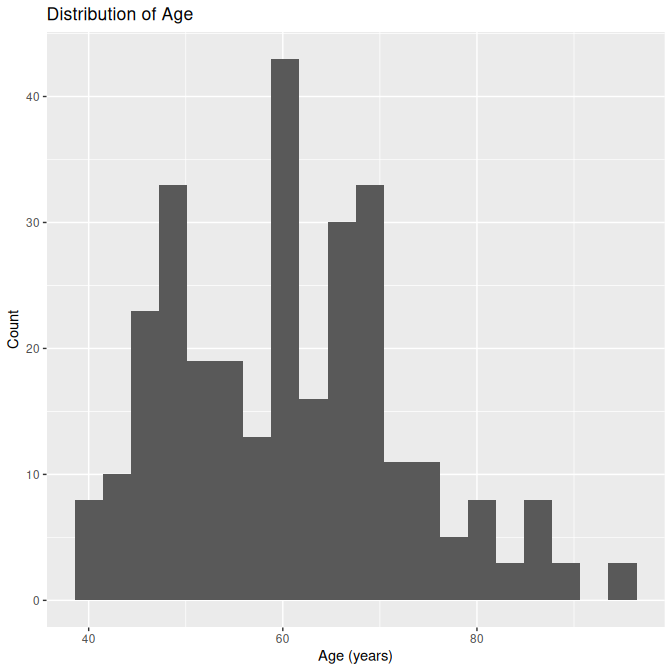<!-- -->

``` r
# Boxplot by survival status: age
ggplot(heart, aes(x = DEATH_EVENT, y = age, fill = DEATH_EVENT)) +
  geom_boxplot() +
  labs(title = "Age by Survival Status", x = "Survival status", y = "Age (years)") +
  theme(legend.position = "none")
```

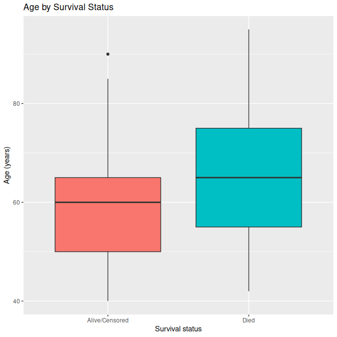<!-- -->

``` r
# Creatinine phosphokinase (mcg/L)
ggplot(heart, aes(x = DEATH_EVENT, y = creatinine_phosphokinase, fill = DEATH_EVENT)) +
  geom_boxplot() +
  labs(title = "Creatinine phosphokinase by Survival Status", x = "Survival status", y = "Creatinine phosphokinase (mcg/L)") +
  theme(legend.position = "none")
```

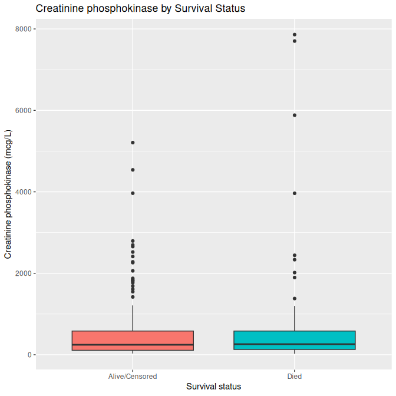<!-- -->

``` r
# Ejection fraction
ggplot(heart, aes(x = DEATH_EVENT, y = ejection_fraction, fill = DEATH_EVENT)) +
  geom_boxplot() +
  labs(title = "Ejection Fraction by Survival Status", x = "Survival status", y = "Ejection fraction (%)") +
  theme(legend.position = "none")
```

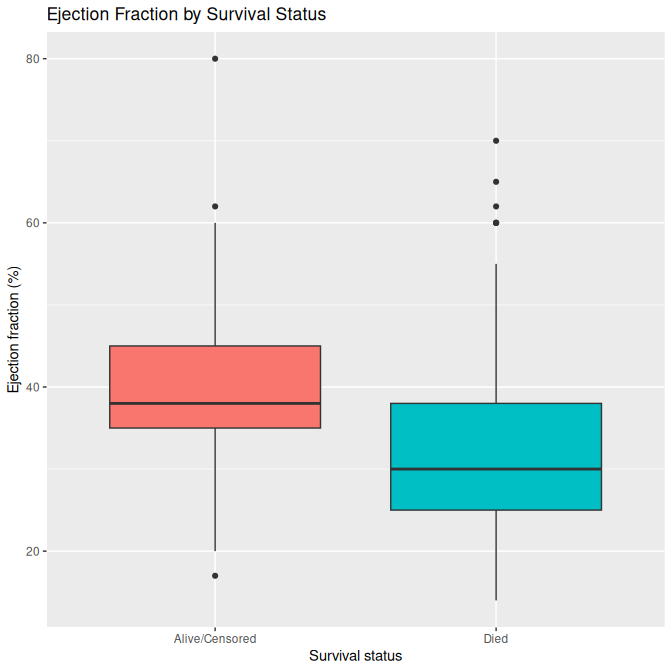<!-- -->

``` r
# Serum creatinine
ggplot(heart, aes(x = DEATH_EVENT, y = serum_creatinine, fill = DEATH_EVENT)) +
  geom_boxplot() +
  labs(title = "Serum Creatinine by Survival Status", x = "Survival status", y = "Serum creatinine (mg/dL)") +
  theme(legend.position = "none")
```

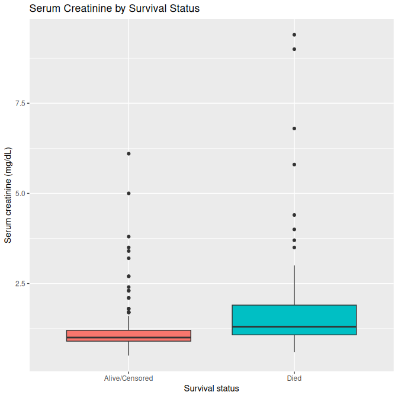<!-- -->

``` r
# Serum sodium
ggplot(heart, aes(x = DEATH_EVENT, y = serum_sodium, fill = DEATH_EVENT)) +
  geom_boxplot() +
  labs(title = "Serum Sodium by Survival Status", x = "Survival status", y = "Serum sodium (mEq/L)") +
  theme(legend.position = "none")
```

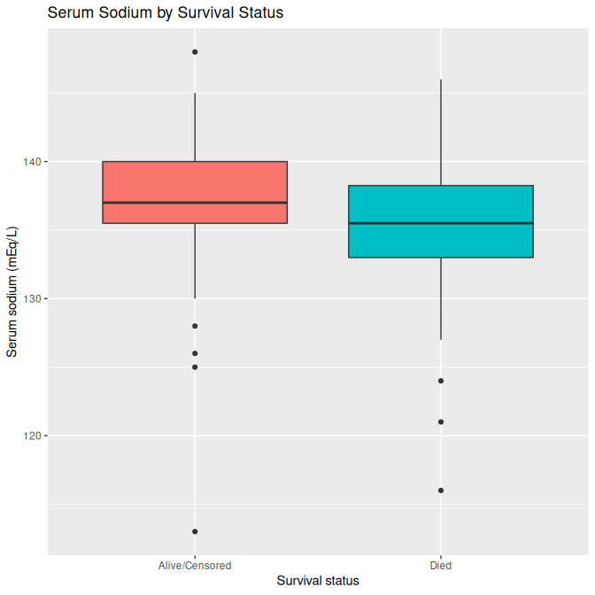<!-- -->

An aggregated version:

``` r
library(tidyr)

# Continuous variables
num_vars <- c("age",
              "creatinine_phosphokinase",
              "ejection_fraction",
              "platelets",
              "serum_creatinine",
              "serum_sodium",
              "time")

# Pretty labels for facets
var_labels <- c(
  age                      = "Age (years)",
  creatinine_phosphokinase = "Creatinine phosphokinase (mcg/L)",
  ejection_fraction        = "Ejection fraction (%)",
  platelets                = "Platelets (k/mL)",
  serum_creatinine         = "Serum creatinine (mg/dL)",
  serum_sodium             = "Serum sodium (mEq/L)",
  time                     = "Follow-up time (days)"
)

heart_cont_long <- heart %>%
  dplyr::select(DEATH_EVENT, all_of(num_vars)) %>%
  pivot_longer(
    cols = all_of(num_vars),
    names_to = "Variable",
    values_to = "Value"
  ) %>%
  mutate(
    Variable = factor(Variable,
                      levels = num_vars,
                      labels = var_labels[num_vars])
  )

ggplot(heart_cont_long,
       aes(x = DEATH_EVENT, y = Value, fill = DEATH_EVENT)) +
  geom_boxplot(outlier.alpha = 0.4) +
  facet_wrap(~ Variable, scales = "free_y") +
  labs(
    title = "Continuous Predictors by Survival Status",
    x = "Survival status",
    y = NULL
  ) +
  theme_minimal() +
  theme(
    legend.position = "none",
    strip.text = element_text(face = "bold"),
    plot.title = element_text(face = "bold", hjust = 0.5)
  )
```

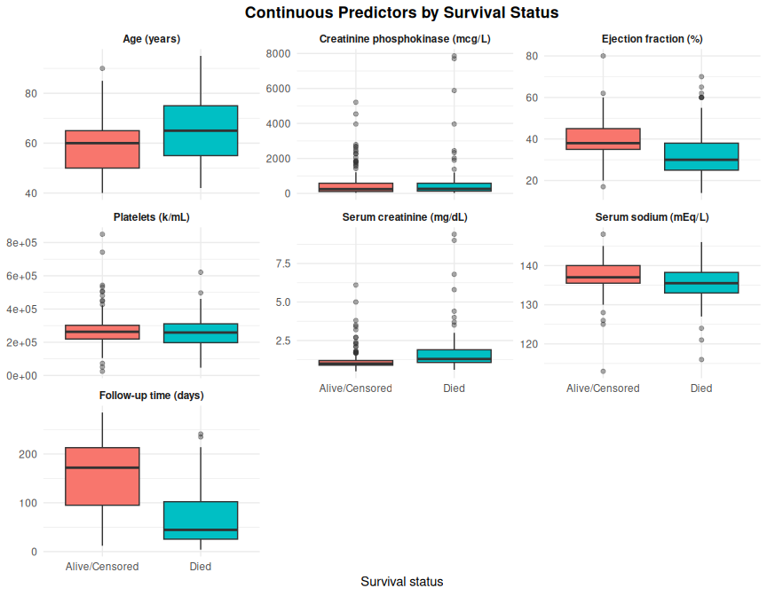<!-- -->

## Categorical variables

An aggregated version:

``` r
library(tidyr)

cat_vars_plot <- c("sex", "anaemia", "diabetes", "high_blood_pressure", "smoking")

heart_cat_long <- heart %>%
  select(DEATH_EVENT, all_of(cat_vars_plot)) %>%
  pivot_longer(
    cols = all_of(cat_vars_plot),
    names_to = "Variable",
    values_to = "Level"
  )

ggplot(heart_cat_long, aes(x = Level, fill = DEATH_EVENT)) +
  geom_bar(position = "fill") +
  scale_y_continuous(labels = scales::percent) +
  labs(
    title = "Proportion of Death Events by Categorical Predictors",
    x = NULL,
    y = "Percentage",
    fill = "Survival status"
  ) +
  facet_wrap(~ Variable, nrow = 2, scales = "free_x") +
  theme_minimal() +
  theme(
    strip.text = element_text(face = "bold"),
    plot.title = element_text(face = "bold", hjust = 0.5)
  )
```

<!-- -->

# Univariate Survival Exploration: Kaplan–Meier Curves

In this section, we examine how survival time differs across subgroups
of individual variables using univariate Kaplan–Meier (KM) curves and
log-rank tests.

We first create a `Surv` object using time to event and death indicator.

``` r
surv_obj <- Surv(time = heart$time, event = heart$DEATH_EVENT == "Died")
surv_obj
```

    ##   [1]   4    6    7    7    8    8   10   10   10   10   10   10   11   11   12+
    ##  [16]  13   14   14   15   15   16+  20   20   22+  23   23   24   26   26   26 
    ##  [31]  27   28   28   29+  29   30   30   30   30+  30   31   32   33   33+  33 
    ##  [46]  35   38   40   41   42   43   43   43   44   45   50   54+  54+  55   59 
    ##  [61]  60   60   60+  61   63+  64   65   65   66   67   68+  71+  72   72+  73 
    ##  [76]  73   74+  74+  74+  74+  75+  76+  77   78+  78   79+  79+  79+  79+  79+
    ##  [91]  80+  80+  82+  82   83+  83+  83+  85+  85+  86+  87+  87+  87+  87+  87+
    ## [106]  88   88+  88+  88+  88+  90   90+  90+  90   91+  91+  94+  94+  94+  95 
    ## [121]  95+  95+  95+  95+  96   97+ 100  104+ 104+ 105+ 106+ 107+ 107+ 107+ 107+
    ## [136] 107+ 107+ 108+ 108+ 108+ 109  109+ 109+ 110+ 111  112+ 112+ 113+ 113  115+
    ## [151] 115  117+ 118+ 119+ 120+ 120+ 120+ 120+ 121+ 121+ 121+ 121+ 123+ 126  129 
    ## [166] 130  134+ 135  140+ 145+ 145+ 146+ 146+ 146+ 146+ 146+ 147+ 147+ 147+ 147+
    ## [181] 148+ 150  154  162  170  171  172  172  172+ 174+ 174+ 174+ 175+ 180+ 180 
    ## [196] 180  185+ 186+ 186+ 186+ 186+ 186+ 186+ 187+ 187+ 187+ 187+ 187+ 187+ 187+
    ## [211] 188+ 192+ 192+ 193  194+ 195+ 196+ 196  197+ 197+ 198  200+ 201+ 201+ 205+
    ## [226] 205+ 205+ 206+ 207+ 207+ 207  208+ 209+ 209+ 209+ 209+ 209+ 210+ 210+ 211+
    ## [241] 212+ 212+ 212+ 213+ 213+ 213+ 214  214+ 214+ 214+ 214+ 215+ 215+ 215+ 215+
    ## [256] 216+ 220+ 230+ 230+ 231+ 233+ 233+ 235  237+ 237+ 240+ 241  244+ 244+ 244+
    ## [271] 244+ 244+ 245+ 245+ 245+ 245+ 245+ 246+ 246+ 246+ 247+ 250+ 250+ 250+ 250+
    ## [286] 250+ 250+ 250+ 256+ 256+ 257+ 258+ 258+ 270+ 270+ 271+ 278+ 280+ 285+

## KM curves for binary clinical variables

### Sex

``` r
fit_sex <- survfit(surv_obj ~ sex, data = heart)

ggsurvplot(
  fit_sex,
  data = heart,
  risk.table = TRUE,
  pval = TRUE,
  conf.int = FALSE,
  legend.title = "Sex"
)
```

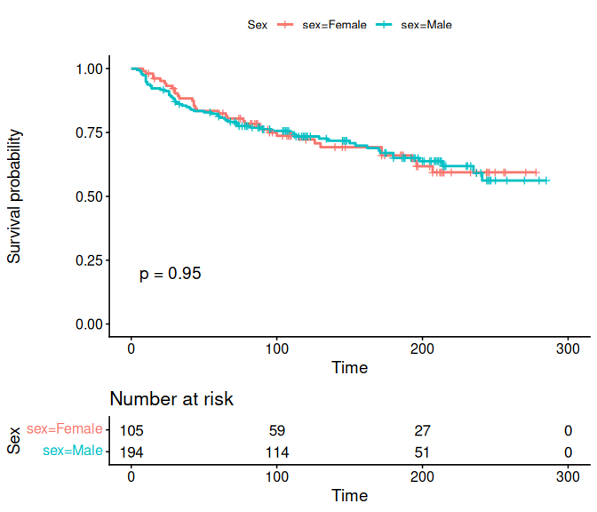<!-- -->

``` r
# Log-rank test
survdiff(surv_obj ~ sex, data = heart)
```

    ## Call:
    ## survdiff(formula = surv_obj ~ sex, data = heart)
    ## 
    ##              N Observed Expected (O-E)^2/E (O-E)^2/V
    ## sex=Female 105       34     34.3   0.00254   0.00397
    ## sex=Male   194       62     61.7   0.00141   0.00397
    ## 
    ##  Chisq= 0  on 1 degrees of freedom, p= 0.9

### Anaemia

``` r
fit_anaemia <- survfit(surv_obj ~ anaemia, data = heart)

ggsurvplot(
  fit_anaemia,
  data = heart,
  risk.table = TRUE,
  pval = TRUE,
  conf.int = FALSE,
  legend.title = "Anaemia"
)
```

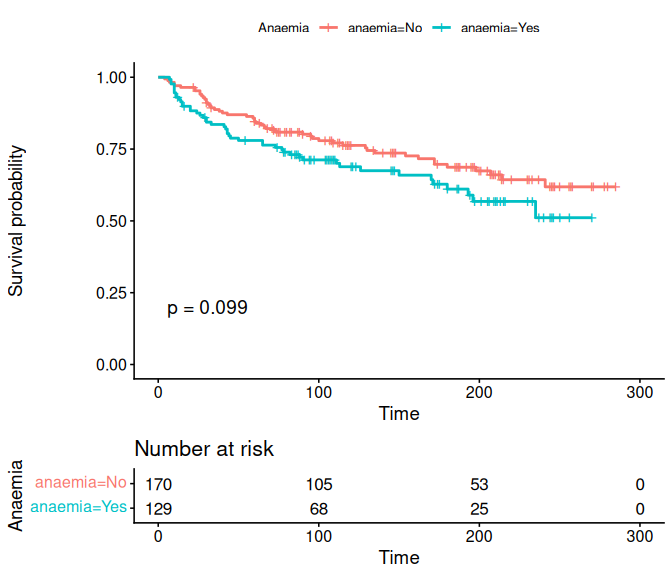<!-- -->

``` r
survdiff(surv_obj ~ anaemia, data = heart)
```

    ## Call:
    ## survdiff(formula = surv_obj ~ anaemia, data = heart)
    ## 
    ##               N Observed Expected (O-E)^2/E (O-E)^2/V
    ## anaemia=No  170       50     57.9      1.07      2.73
    ## anaemia=Yes 129       46     38.1      1.63      2.73
    ## 
    ##  Chisq= 2.7  on 1 degrees of freedom, p= 0.1

### Diabetes

``` r
fit_diabetes <- survfit(surv_obj ~ diabetes, data = heart)

ggsurvplot(
  fit_diabetes,
  data = heart,
  risk.table = TRUE,
  pval = TRUE,
  conf.int = FALSE,
  legend.title = "Diabetes"
)
```

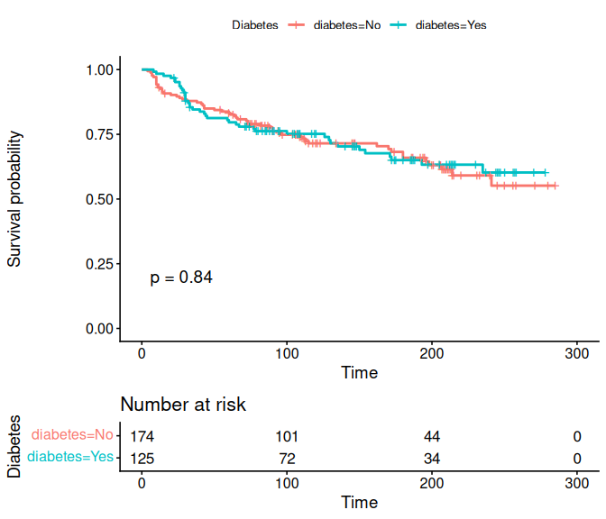<!-- -->

``` r
survdiff(surv_obj ~ diabetes, data = heart)
```

    ## Call:
    ## survdiff(formula = surv_obj ~ diabetes, data = heart)
    ## 
    ##                N Observed Expected (O-E)^2/E (O-E)^2/V
    ## diabetes=No  174       56       55    0.0172    0.0405
    ## diabetes=Yes 125       40       41    0.0231    0.0405
    ## 
    ##  Chisq= 0  on 1 degrees of freedom, p= 0.8

### High blood pressure

``` r
fit_hbp <- survfit(surv_obj ~ high_blood_pressure, data = heart)

ggsurvplot(
  fit_hbp,
  data = heart,
  risk.table = TRUE,
  pval = TRUE,
  conf.int = FALSE,
  legend.title = "High blood pressure"
)
```

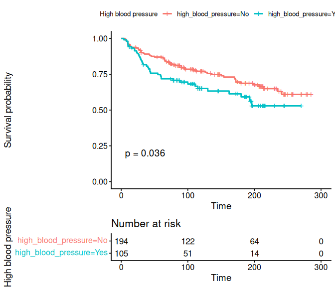<!-- -->

``` r
survdiff(surv_obj ~ high_blood_pressure, data = heart)
```

    ## Call:
    ## survdiff(formula = surv_obj ~ high_blood_pressure, data = heart)
    ## 
    ##                           N Observed Expected (O-E)^2/E (O-E)^2/V
    ## high_blood_pressure=No  194       57     66.4      1.34      4.41
    ## high_blood_pressure=Yes 105       39     29.6      3.00      4.41
    ## 
    ##  Chisq= 4.4  on 1 degrees of freedom, p= 0.04

### Smoking

``` r
fit_smoking <- survfit(surv_obj ~ smoking, data = heart)

ggsurvplot(
  fit_smoking,
  data = heart,
  risk.table = TRUE,
  pval = TRUE,
  conf.int = FALSE,
  legend.title = "Smoking"
)
```

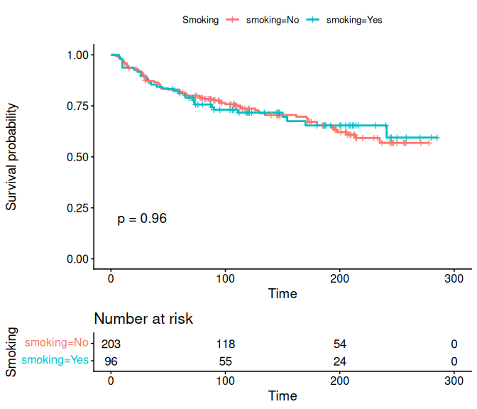<!-- -->

``` r
survdiff(surv_obj ~ smoking, data = heart)
```

    ## Call:
    ## survdiff(formula = surv_obj ~ smoking, data = heart)
    ## 
    ##               N Observed Expected (O-E)^2/E (O-E)^2/V
    ## smoking=No  203       66     65.8   0.00064   0.00204
    ## smoking=Yes  96       30     30.2   0.00139   0.00204
    ## 
    ##  Chisq= 0  on 1 degrees of freedom, p= 1

## KM curves for grouped continuous variables

For continuous predictors, we create grouped versions and then draw KM
curves.

``` r
heart <- heart %>%
  mutate(
    # Age quartiles
    age_group = cut(
      age,
      breaks = quantile(age, probs = seq(0, 1, by = 0.25), na.rm = TRUE),
      include.lowest = TRUE,
      dig.lab = 4
    ),
    # Ejection fraction: clinically meaningful cutoffs (example)
    ef_group = cut(
      ejection_fraction,
      breaks = c(-Inf, 30, 45, Inf),
      labels = c("<=30", "30–45", ">45")
    ),
    # Serum creatinine quartiles
    creatinine_group = cut(
      serum_creatinine,
      breaks = quantile(serum_creatinine, probs = seq(0, 1, by = 0.25), na.rm = TRUE),
      include.lowest = TRUE,
      dig.lab = 4
    ),
    # Serum sodium quartiles
    sodium_group = cut(
      serum_sodium,
      breaks = quantile(serum_sodium, probs = seq(0, 1, by = 0.25), na.rm = TRUE),
      include.lowest = TRUE,
      dig.lab = 4
    )
  )

summary(heart$age_group)
```

    ## [40,51] (51,60] (60,70] (70,95] 
    ##      78      84      85      52

``` r
summary(heart$ef_group)
```

    ##  <=30 30–45   >45 
    ##    93   146    60

``` r
summary(heart$creatinine_group)
```

    ## [0.5,0.9] (0.9,1.1] (1.1,1.4] (1.4,9.4] 
    ##        81        82        64        72

``` r
summary(heart$sodium_group)
```

    ## [113,134] (134,137] (137,140] (140,148] 
    ##        83        94        80        42

``` r
# Update Surv object after creating groups (same definition)
surv_obj <- Surv(time = heart$time, event = heart$DEATH_EVENT == "Died")
```

### Age groups

``` r
fit_age <- survfit(surv_obj ~ age_group, data = heart)

ggsurvplot(
  fit_age,
  data = heart,
  risk.table = TRUE,
  pval = TRUE,
  conf.int = FALSE,
  legend.title = "Age group"
)
```

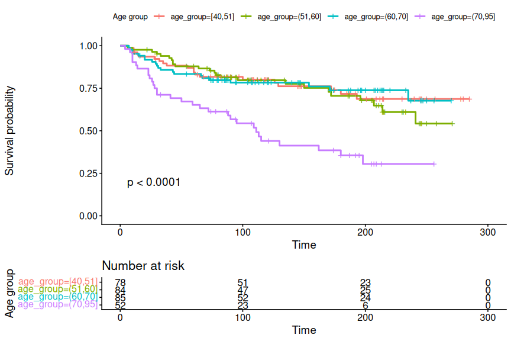<!-- -->

``` r
survdiff(surv_obj ~ age_group, data = heart)
```

    ## Call:
    ## survdiff(formula = surv_obj ~ age_group, data = heart)
    ## 
    ##                    N Observed Expected (O-E)^2/E (O-E)^2/V
    ## age_group=[40,51] 78       20     26.8     1.705     2.380
    ## age_group=(51,60] 84       24     28.0     0.573     0.813
    ## age_group=(60,70] 85       21     27.9     1.702     2.408
    ## age_group=(70,95] 52       31     13.3    23.343    27.399
    ## 
    ##  Chisq= 27.6  on 3 degrees of freedom, p= 4e-06

### Ejection fraction groups

``` r
fit_ef <- survfit(surv_obj ~ ef_group, data = heart)

ggsurvplot(
  fit_ef,
  data = heart,
  risk.table = TRUE,
  pval = TRUE,
  conf.int = FALSE,
  legend.title = "Ejection fraction group"
)
```

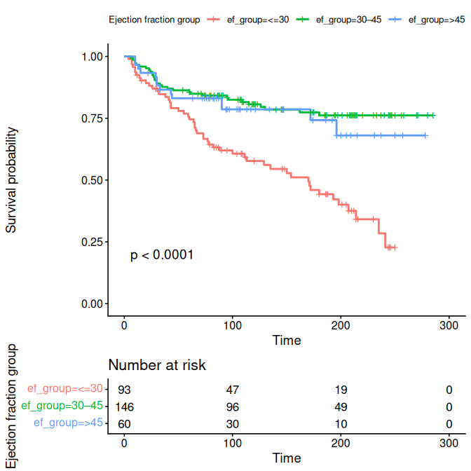<!-- -->

``` r
survdiff(surv_obj ~ ef_group, data = heart)
```

    ## Call:
    ## survdiff(formula = surv_obj ~ ef_group, data = heart)
    ## 
    ##                  N Observed Expected (O-E)^2/E (O-E)^2/V
    ## ef_group=<=30   93       51     26.8     21.93     30.63
    ## ef_group=30–45 146       31     51.2      7.97     17.32
    ## ef_group=>45    60       14     18.0      0.90      1.12
    ## 
    ##  Chisq= 31.1  on 2 degrees of freedom, p= 2e-07

### Serum creatinine groups

``` r
fit_creat <- survfit(surv_obj ~ creatinine_group, data = heart)

ggsurvplot(
  fit_creat,
  data = heart,
  risk.table = TRUE,
  pval = TRUE,
  conf.int = FALSE,
  legend.title = "Serum creatinine (quartiles)"
)
```

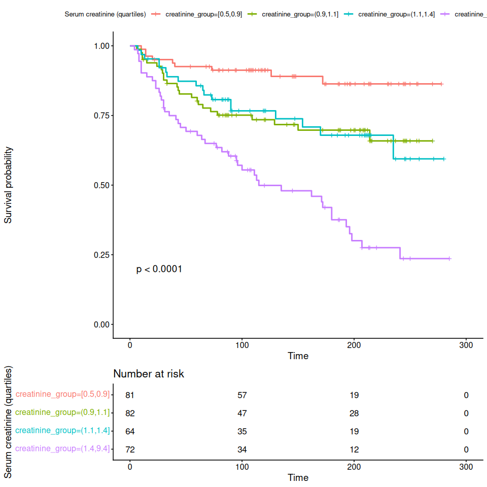<!-- -->

``` r
survdiff(surv_obj ~ creatinine_group, data = heart)
```

    ## Call:
    ## survdiff(formula = surv_obj ~ creatinine_group, data = heart)
    ## 
    ##                             N Observed Expected (O-E)^2/E (O-E)^2/V
    ## creatinine_group=[0.5,0.9] 81        9     28.1    12.972    18.428
    ## creatinine_group=(0.9,1.1] 82       24     27.1     0.365     0.512
    ## creatinine_group=(1.1,1.4] 64       18     20.7     0.341     0.436
    ## creatinine_group=(1.4,9.4] 72       45     20.1    30.808    39.185
    ## 
    ##  Chisq= 44.7  on 3 degrees of freedom, p= 1e-09

### Serum sodium groups

``` r
fit_sodium <- survfit(surv_obj ~ sodium_group, data = heart)

ggsurvplot(
  fit_sodium,
  data = heart,
  risk.table = TRUE,
  pval = TRUE,
  conf.int = FALSE,
  legend.title = "Serum sodium (quartiles)"
)
```

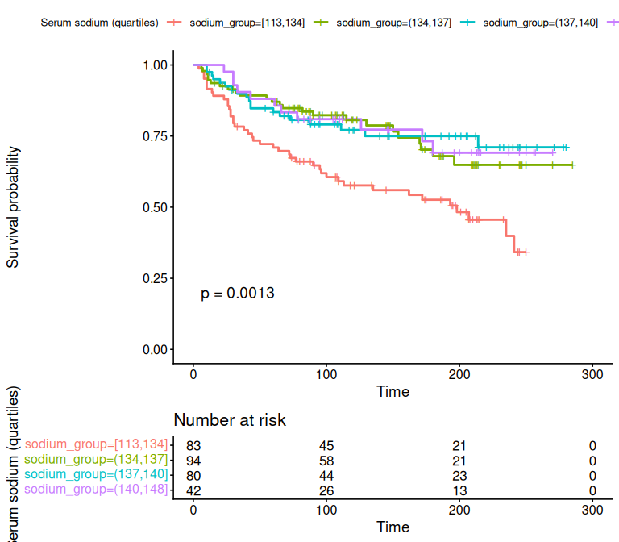<!-- -->

``` r
survdiff(surv_obj ~ sodium_group, data = heart)
```

    ## Call:
    ## survdiff(formula = surv_obj ~ sodium_group, data = heart)
    ## 
    ##                         N Observed Expected (O-E)^2/E (O-E)^2/V
    ## sodium_group=[113,134] 83       42     25.0    11.518     15.65
    ## sodium_group=(134,137] 94       24     30.3     1.311      1.93
    ## sodium_group=(137,140] 80       19     25.9     1.838      2.53
    ## sodium_group=(140,148] 42       11     14.8     0.964      1.14
    ## 
    ##  Chisq= 15.7  on 3 degrees of freedom, p= 0.001

# Summary of EDA Findings

- Which variables show clear differences between patients who died and
  those who survived in the descriptive tables?

Patients who died tended to be older, had **lower ejection fraction,
higher serum creatinine, and lower sodium levels**, indicating more
severe cardiac and renal dysfunction. Sex, diabetes, smoking, and
anaemia showed minimal differences between groups.

- Which KM curves show clear separation and statistically significant
  log-rank tests?

Clear separation was observed for high blood pressure, age \>70,
ejection fraction \<30%, serum creatinine \>1.4 mg/dL or serum
creatinine \< 0.9 mg/dL , and serum sodium 113–134 mEq/L, all
demonstrating visibly worse survival patterns.(Anaemia’s P value is
0.099, not significant, but there’s serparated patten between 2 lines)

- Are the directions consistent with clinical expectations

Yes — poorer survival was associated with low EF, high creatinine, and
low sodium, which aligns with known pathways of heart failure severity
and cardiorenal decline. Older age also behaved predictably as a strong
mortality predictor.

- Which variables appear promising to include in later multivariable
  models?

The strongest candidates include **age, ejection fraction, serum
creatinine, serum sodium, and high blood pressure**, as they
demonstrated both statistical relevance and clear biological
interpretability.
