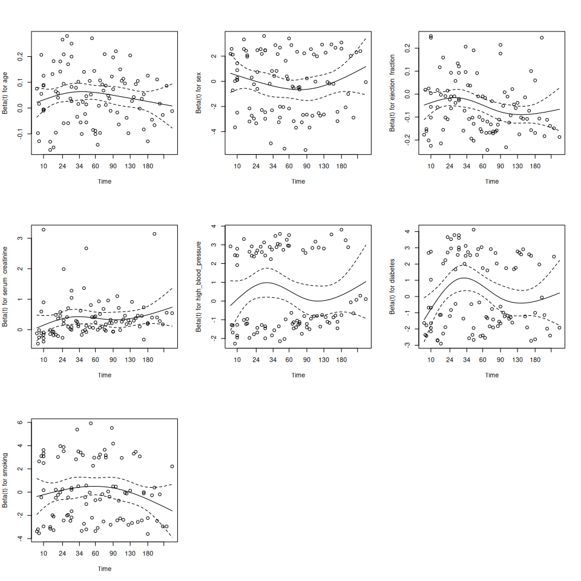
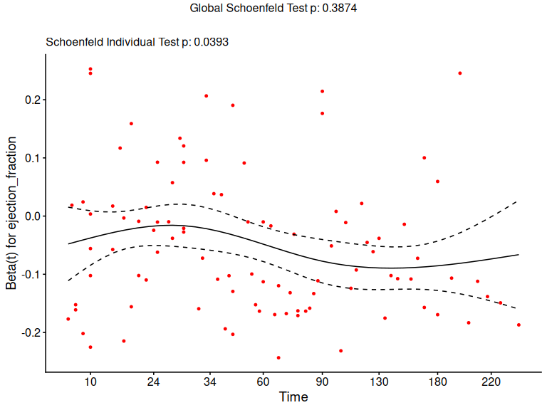
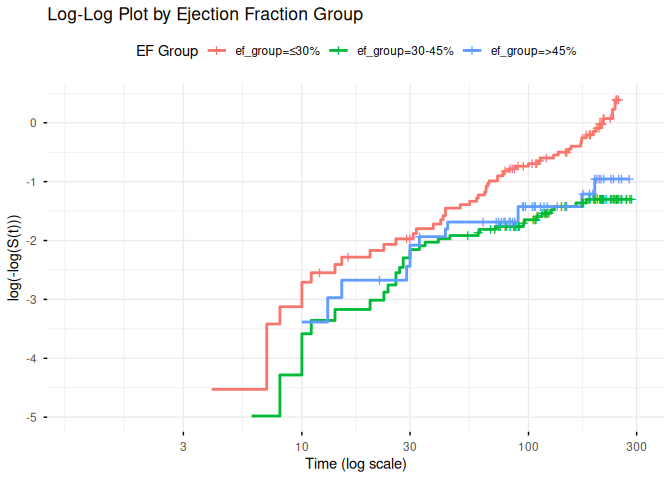
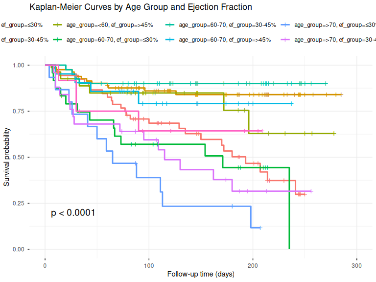

Survival Analysis Final Project – PH Assumption & Interaction Effects
================
Xuange Liang
2025-12-04

- [1 Introduction](#1-introduction)
- [2 Data Preparation](#2-data-preparation)
- [3 Part 1: Proportional Hazards Assumption
  Testing](#3-part-1-proportional-hazards-assumption-testing)
  - [3.1 Fit the Full Cox Model](#31-fit-the-full-cox-model)
  - [3.2 Schoenfeld Residuals Test](#32-schoenfeld-residuals-test)
    - [3.2.1 Interpretation of Schoenfeld Test
      Results](#321-interpretation-of-schoenfeld-test-results)
  - [3.3 Schoenfeld Residuals Plots](#33-schoenfeld-residuals-plots)
  - [3.4 Log-Log Survival Plots](#34-log-log-survival-plots)
    - [3.4.1 Log-Log Plot by Ejection Fraction
      Groups](#341-log-log-plot-by-ejection-fraction-groups)
  - [3.5 Handling the EF Violation: Stratified Cox
    Model](#35-handling-the-ef-violation-stratified-cox-model)
- [4 Part 2: Interaction Effects
  Exploration](#4-part-2-interaction-effects-exploration)
  - [4.1 Baseline Model (No
    Interaction)](#41-baseline-model-no-interaction)
  - [4.2 Age × Ejection Fraction
    Interaction](#42-age--ejection-fraction-interaction)
    - [4.2.1 Fit Model with
      Interaction](#421-fit-model-with-interaction)
    - [4.2.2 Likelihood Ratio Test for
      Interaction](#422-likelihood-ratio-test-for-interaction)
    - [4.2.3 Visualization of Age × EF
      Interaction](#423-visualization-of-age--ef-interaction)
- [5 Final Model Selection](#5-final-model-selection)
  - [5.1 Option 1: Model with Age × EF
    Interaction](#51-option-1-model-with-age--ef-interaction)
  - [5.2 Option 2: Stratified Model by EF
    Group](#52-option-2-stratified-model-by-ef-group)
  - [5.3 Model Comparison](#53-model-comparison)
  - [5.4 Recommended Final Model](#54-recommended-final-model)

# 1 Introduction

This code focuses on two steps in Cox modelling:

1.  **Proportional Hazards (PH) Assumption Testing**: Verifying that the
    hazard ratio between groups remains constant over time.
2.  **Interaction Effects Exploration**: Investigating whether the
    effect of one predictor depends on the level of another predictor

# 2 Data Preparation

``` r
# Load the heart failure dataset
heart <- read.csv("heart_failure_clinical_records_dataset.csv")

# Quick structure check
str(heart)
```

    ## 'data.frame':    299 obs. of  13 variables:
    ##  $ age                     : num  75 55 65 50 65 90 75 60 65 80 ...
    ##  $ anaemia                 : int  0 0 0 1 1 1 1 1 0 1 ...
    ##  $ creatinine_phosphokinase: int  582 7861 146 111 160 47 246 315 157 123 ...
    ##  $ diabetes                : int  0 0 0 0 1 0 0 1 0 0 ...
    ##  $ ejection_fraction       : int  20 38 20 20 20 40 15 60 65 35 ...
    ##  $ high_blood_pressure     : int  1 0 0 0 0 1 0 0 0 1 ...
    ##  $ platelets               : num  265000 263358 162000 210000 327000 ...
    ##  $ serum_creatinine        : num  1.9 1.1 1.3 1.9 2.7 2.1 1.2 1.1 1.5 9.4 ...
    ##  $ serum_sodium            : int  130 136 129 137 116 132 137 131 138 133 ...
    ##  $ sex                     : int  1 1 1 1 0 1 1 1 0 1 ...
    ##  $ smoking                 : int  0 0 1 0 0 1 0 1 0 1 ...
    ##  $ time                    : int  4 6 7 7 8 8 10 10 10 10 ...
    ##  $ DEATH_EVENT             : int  1 1 1 1 1 1 1 1 1 1 ...

``` r
# Create factor versions for categorical variables
heart <- heart %>%
  mutate(
    sex_factor = factor(sex, levels = c(0, 1), labels = c("Female", "Male")),
    anaemia_factor = factor(anaemia, levels = c(0, 1), labels = c("No", "Yes")),
    diabetes_factor = factor(diabetes, levels = c(0, 1), labels = c("No", "Yes")),
    high_bp_factor = factor(high_blood_pressure, levels = c(0, 1), labels = c("No", "Yes")),
    smoking_factor = factor(smoking, levels = c(0, 1), labels = c("No", "Yes")),
    # Create grouped variables for visualization
    age_group = cut(age, breaks = c(0, 60, 70, Inf), labels = c("<60", "60-70", ">70")),
    ef_group = cut(ejection_fraction, breaks = c(0, 30, 45, Inf), labels = c("≤30%", "30-45%", ">45%"))
  )

# Create survival object
surv_obj <- Surv(time = heart$time, event = heart$DEATH_EVENT)
```

# 3 Part 1: Proportional Hazards Assumption Testing

The Cox proportional hazards model assumes that the hazard ratio between
any two individuals is constant over time (i.e., the survival curves for
different groups should not cross). Violations of this assumption may
lead to biased estimates and incorrect inferences.

## 3.1 Fit the Full Cox Model

We first fit the full multivariable Cox model as specified in
`analysis_1.Rmd`.

``` r
cox_full <- coxph(
  surv_obj ~ age + sex + ejection_fraction + serum_creatinine + 
    high_blood_pressure + diabetes + smoking,
  data = heart
)

summary(cox_full)
```

    ## Call:
    ## coxph(formula = surv_obj ~ age + sex + ejection_fraction + serum_creatinine + 
    ##     high_blood_pressure + diabetes + smoking, data = heart)
    ## 
    ##   n= 299, number of events= 96 
    ## 
    ##                          coef exp(coef)  se(coef)      z Pr(>|z|)    
    ## age                  0.046130  1.047211  0.009319  4.950 7.43e-07 ***
    ## sex                 -0.133981  0.874606  0.243868 -0.549   0.5827    
    ## ejection_fraction   -0.050223  0.951017  0.010178 -4.934 8.04e-07 ***
    ## serum_creatinine     0.357357  1.429545  0.067673  5.281 1.29e-07 ***
    ## high_blood_pressure  0.449465  1.567473  0.213100  2.109   0.0349 *  
    ## diabetes             0.173265  1.189181  0.217661  0.796   0.4260    
    ## smoking              0.060161  1.062008  0.248380  0.242   0.8086    
    ## ---
    ## Signif. codes:  0 '***' 0.001 '**' 0.01 '*' 0.05 '.' 0.1 ' ' 1
    ## 
    ##                     exp(coef) exp(-coef) lower .95 upper .95
    ## age                    1.0472     0.9549    1.0283    1.0665
    ## sex                    0.8746     1.1434    0.5423    1.4106
    ## ejection_fraction      0.9510     1.0515    0.9322    0.9702
    ## serum_creatinine       1.4295     0.6995    1.2520    1.6323
    ## high_blood_pressure    1.5675     0.6380    1.0323    2.3801
    ## diabetes               1.1892     0.8409    0.7762    1.8219
    ## smoking                1.0620     0.9416    0.6527    1.7280
    ## 
    ## Concordance= 0.73  (se = 0.029 )
    ## Likelihood ratio test= 72.29  on 7 df,   p=5e-13
    ## Wald test            = 78.52  on 7 df,   p=3e-14
    ## Score (logrank) test = 78.59  on 7 df,   p=3e-14

## 3.2 Schoenfeld Residuals Test

The most common approach to test the PH assumption is the **Schoenfeld
residuals test** (`cox.zph()`). This test evaluates whether the
Schoenfeld residuals show a systematic trend with time. A significant
p-value (\< 0.05) suggests a violation of the PH assumption for that
covariate.

``` r
ph_test <- cox.zph(cox_full)

# Print the test results
print(ph_test)
```

    ##                      chisq df     p
    ## age                 0.3153  1 0.574
    ## sex                 0.1050  1 0.746
    ## ejection_fraction   4.2472  1 0.039
    ## serum_creatinine    1.3215  1 0.250
    ## high_blood_pressure 0.0391  1 0.843
    ## diabetes            0.0645  1 0.799
    ## smoking             0.3770  1 0.539
    ## GLOBAL              7.4109  7 0.387

### 3.2.1 Interpretation of Schoenfeld Test Results

``` r
# Create a summary table of PH test results
ph_results <- data.frame(
  Variable = rownames(ph_test$table),
  Chisq = round(ph_test$table[, "chisq"], 3),
  df = ph_test$table[, "df"],
  p_value = round(ph_test$table[, "p"], 4)
) %>%
  mutate(
    PH_Assumption = ifelse(p_value < 0.05, "Violated", "Satisfied")
  )

knitr::kable(
  ph_results,
  caption = "Schoenfeld Residuals Test for Proportional Hazards Assumption",
  col.names = c("Variable", "Chi-square", "df", "p-value", "PH Assumption")
)
```

|                     | Variable            | Chi-square |  df | p-value | PH Assumption |
|---------------------|:--------------------|-----------:|----:|--------:|---------------|
| age                 | age                 |      0.315 |   1 |  0.5744 | Satisfied     |
| sex                 | sex                 |      0.105 |   1 |  0.7459 | Satisfied     |
| ejection_fraction   | ejection_fraction   |      4.247 |   1 |  0.0393 | Violated      |
| serum_creatinine    | serum_creatinine    |      1.321 |   1 |  0.2503 | Satisfied     |
| high_blood_pressure | high_blood_pressure |      0.039 |   1 |  0.8432 | Satisfied     |
| diabetes            | diabetes            |      0.065 |   1 |  0.7995 | Satisfied     |
| smoking             | smoking             |      0.377 |   1 |  0.5392 | Satisfied     |
| GLOBAL              | GLOBAL              |      7.411 |   7 |  0.3874 | Satisfied     |

Schoenfeld Residuals Test for Proportional Hazards Assumption

**Key Finding**: The Schoenfeld test reveals that **ejection fraction**
marginally violates the PH assumption (p = 0.039), while all other
covariates satisfy the assumption. The global test (p = 0.387) suggests
the overall model adequacy is acceptable.

## 3.3 Schoenfeld Residuals Plots

Visual inspection of the Schoenfeld residuals over time can provide
additional insight into potential violations. If the PH assumption
holds, the residuals should show no systematic trend (the smoothed line
should be approximately horizontal).

``` r
# Plot Schoenfeld residuals for all variables
par(mfrow = c(3, 3))
plot(ph_test)
```

<!-- -->

``` r
# Focus on ejection fraction (the variable with PH violation)
ggcoxzph(ph_test, var = "ejection_fraction", font.main = 12)
```

<!-- -->

The plot for ejection fraction shows a slight upward trend in the
residuals over time, indicating that the effect of EF on hazard may
decrease (become less protective) as time progresses.

## 3.4 Log-Log Survival Plots

An alternative graphical method is the **log-log survival plot**. If the
PH assumption holds, the log-log survival curves for different groups
should be approximately parallel.

### 3.4.1 Log-Log Plot by Ejection Fraction Groups

``` r
fit_ef <- survfit(surv_obj ~ ef_group, data = heart)

ggsurvplot(
  fit_ef,
  data = heart,
  fun = "cloglog",
  xlab = "Time (log scale)",
  ylab = "log(-log(S(t)))",
  title = "Log-Log Plot by Ejection Fraction Group",
  legend.title = "EF Group",
  ggtheme = theme_minimal()
)
```

<!-- -->

The log-log plot shows that the curves for different EF groups are not
perfectly parallel, particularly at later time points, which
corroborates the Schoenfeld test finding.

## 3.5 Handling the EF Violation: Stratified Cox Model

Since ejection fraction violates the PH assumption, we fit a
**stratified Cox model** that allows different baseline hazards for each
EF group while estimating common effects for other covariates.

``` r
# Stratify by ejection fraction group
cox_stratified_ef <- coxph(
  surv_obj ~ age + sex + serum_creatinine + 
    high_blood_pressure + diabetes + smoking + strata(ef_group),
  data = heart
)

summary(cox_stratified_ef)
```

    ## Call:
    ## coxph(formula = surv_obj ~ age + sex + serum_creatinine + high_blood_pressure + 
    ##     diabetes + smoking + strata(ef_group), data = heart)
    ## 
    ##   n= 299, number of events= 96 
    ## 
    ##                          coef exp(coef)  se(coef)      z Pr(>|z|)    
    ## age                  0.052740  1.054156  0.009607  5.490 4.02e-08 ***
    ## sex                 -0.052473  0.948880  0.243385 -0.216   0.8293    
    ## serum_creatinine     0.290173  1.336659  0.068460  4.239 2.25e-05 ***
    ## high_blood_pressure  0.493040  1.637287  0.216252  2.280   0.0226 *  
    ## diabetes             0.190857  1.210287  0.218754  0.872   0.3829    
    ## smoking             -0.036173  0.964474  0.250065 -0.145   0.8850    
    ## ---
    ## Signif. codes:  0 '***' 0.001 '**' 0.01 '*' 0.05 '.' 0.1 ' ' 1
    ## 
    ##                     exp(coef) exp(-coef) lower .95 upper .95
    ## age                    1.0542     0.9486    1.0345     1.074
    ## sex                    0.9489     1.0539    0.5889     1.529
    ## serum_creatinine       1.3367     0.7481    1.1688     1.529
    ## high_blood_pressure    1.6373     0.6108    1.0716     2.501
    ## diabetes               1.2103     0.8263    0.7883     1.858
    ## smoking                0.9645     1.0368    0.5908     1.575
    ## 
    ## Concordance= 0.698  (se = 0.033 )
    ## Likelihood ratio test= 48.74  on 6 df,   p=8e-09
    ## Wald test            = 50.97  on 6 df,   p=3e-09
    ## Score (logrank) test = 54.36  on 6 df,   p=6e-10

In the stratified model, we no longer estimate a hazard ratio for
ejection fraction directly, but instead allow the baseline hazard to
vary across EF groups. This approach addresses the PH violation while
still estimating effects of other predictors.

# 4 Part 2: Interaction Effects Exploration

Interaction effects occur when the effect of one predictor on survival
depends on the level of another predictor. We test several clinically
meaningful interactions.

## 4.1 Baseline Model (No Interaction)

``` r
cox_no_interaction <- coxph(
  surv_obj ~ age + ejection_fraction + sex + serum_creatinine + 
    high_blood_pressure + diabetes + smoking,
  data = heart
)
```

## 4.2 Age × Ejection Fraction Interaction

We hypothesize that the protective effect of higher ejection fraction
may differ across age groups. For instance, older patients with low EF
might have particularly poor survival.

### 4.2.1 Fit Model with Interaction

``` r
cox_interaction_age_ef <- coxph(
  surv_obj ~ age * ejection_fraction + sex + serum_creatinine + 
    high_blood_pressure + diabetes + smoking,
  data = heart
)

summary(cox_interaction_age_ef)
```

    ## Call:
    ## coxph(formula = surv_obj ~ age * ejection_fraction + sex + serum_creatinine + 
    ##     high_blood_pressure + diabetes + smoking, data = heart)
    ## 
    ##   n= 299, number of events= 96 
    ## 
    ##                             coef  exp(coef)   se(coef)      z Pr(>|z|)    
    ## age                   -0.0284672  0.9719342  0.0306798 -0.928 0.353470    
    ## ejection_fraction     -0.1898523  0.8270813  0.0567266 -3.347 0.000818 ***
    ## sex                   -0.1053874  0.8999758  0.2431943 -0.433 0.664763    
    ## serum_creatinine       0.3922667  1.4803325  0.0705722  5.558 2.72e-08 ***
    ## high_blood_pressure    0.4648143  1.5917186  0.2126959  2.185 0.028863 *  
    ## diabetes               0.1815196  1.1990380  0.2189770  0.829 0.407136    
    ## smoking                0.0802458  1.0835534  0.2491176  0.322 0.747362    
    ## age:ejection_fraction  0.0021553  1.0021576  0.0008506  2.534 0.011279 *  
    ## ---
    ## Signif. codes:  0 '***' 0.001 '**' 0.01 '*' 0.05 '.' 0.1 ' ' 1
    ## 
    ##                       exp(coef) exp(-coef) lower .95 upper .95
    ## age                      0.9719     1.0289    0.9152    1.0322
    ## ejection_fraction        0.8271     1.2091    0.7401    0.9243
    ## sex                      0.9000     1.1111    0.5588    1.4496
    ## serum_creatinine         1.4803     0.6755    1.2891    1.6999
    ## high_blood_pressure      1.5917     0.6283    1.0491    2.4150
    ## diabetes                 1.1990     0.8340    0.7806    1.8417
    ## smoking                  1.0836     0.9229    0.6650    1.7656
    ## age:ejection_fraction    1.0022     0.9978    1.0005    1.0038
    ## 
    ## Concordance= 0.746  (se = 0.029 )
    ## Likelihood ratio test= 78.24  on 8 df,   p=1e-13
    ## Wald test            = 77.38  on 8 df,   p=2e-13
    ## Score (logrank) test = 78.61  on 8 df,   p=9e-14

### 4.2.2 Likelihood Ratio Test for Interaction

``` r
# Compare models using likelihood ratio test
lrt_age_ef <- anova(cox_no_interaction, cox_interaction_age_ef, test = "LRT")
print(lrt_age_ef)
```

    ## Analysis of Deviance Table
    ##  Cox model: response is  surv_obj
    ##  Model 1: ~ age + ejection_fraction + sex + serum_creatinine + high_blood_pressure + diabetes + smoking
    ##  Model 2: ~ age * ejection_fraction + sex + serum_creatinine + high_blood_pressure + diabetes + smoking
    ##    loglik  Chisq Df Pr(>|Chi|)  
    ## 1 -473.06                       
    ## 2 -470.09 5.9519  1     0.0147 *
    ## ---
    ## Signif. codes:  0 '***' 0.001 '**' 0.01 '*' 0.05 '.' 0.1 ' ' 1

**Result**: The Age × Ejection Fraction interaction is **statistically
significant** (p = 0.015), indicating that the effect of ejection
fraction on survival depends on patient age.

### 4.2.3 Visualization of Age × EF Interaction

``` r
# KM curves stratified by both age and EF
fit_age_ef <- survfit(surv_obj ~ age_group + ef_group, data = heart)

ggsurvplot(
  fit_age_ef,
  data = heart,
  pval = TRUE,
  risk.table = FALSE,
  legend.title = "Age × EF",
  xlab = "Follow-up time (days)",
  ylab = "Survival probability",
  title = "Kaplan-Meier Curves by Age Group and Ejection Fraction",
  ggtheme = theme_minimal()
)
```

<!-- -->

``` r
# Faceted KM curves
ggsurvplot_facet(
  survfit(Surv(time, DEATH_EVENT) ~ ef_group, data = heart),
  data = heart,
  facet.by = "age_group",
  pval = TRUE,
  legend.title = "EF Group",
  xlab = "Follow-up time (days)",
  ylab = "Survival probability",
  title = "Survival by EF Group, Faceted by Age Group"
)
```

<!-- -->

**Clinical Interpretation**: The visualization shows that:

- In younger patients (\<60), survival differences between EF groups are
  less pronounced.
- In older patients (\>70), low EF (≤30%) is associated with
  dramatically worse survival.
- The protective effect of higher EF is more pronounced in older
  patients.

This significant interaction suggests that the apparent
non-proportionality of ejection fraction (detected in the Schoenfeld
test) can be explained by effect modification by age.

# 5 Final Model Selection

Based on the diagnostic analyses:

1.  **Ejection fraction** violates the PH assumption (p = 0.039)
2.  **Age × EF interaction** is statistically significant (p = 0.015)

Therefore, we consider two alternative final models:

## 5.1 Option 1: Model with Age × EF Interaction

This model accounts for the significant interaction and implicitly
addresses the non-proportionality of EF by allowing its effect to vary
with age.

``` r
cox_final_interaction <- coxph(
  surv_obj ~ age * ejection_fraction + sex + serum_creatinine + 
    high_blood_pressure + diabetes + smoking,
  data = heart
)

summary(cox_final_interaction)
```

    ## Call:
    ## coxph(formula = surv_obj ~ age * ejection_fraction + sex + serum_creatinine + 
    ##     high_blood_pressure + diabetes + smoking, data = heart)
    ## 
    ##   n= 299, number of events= 96 
    ## 
    ##                             coef  exp(coef)   se(coef)      z Pr(>|z|)    
    ## age                   -0.0284672  0.9719342  0.0306798 -0.928 0.353470    
    ## ejection_fraction     -0.1898523  0.8270813  0.0567266 -3.347 0.000818 ***
    ## sex                   -0.1053874  0.8999758  0.2431943 -0.433 0.664763    
    ## serum_creatinine       0.3922667  1.4803325  0.0705722  5.558 2.72e-08 ***
    ## high_blood_pressure    0.4648143  1.5917186  0.2126959  2.185 0.028863 *  
    ## diabetes               0.1815196  1.1990380  0.2189770  0.829 0.407136    
    ## smoking                0.0802458  1.0835534  0.2491176  0.322 0.747362    
    ## age:ejection_fraction  0.0021553  1.0021576  0.0008506  2.534 0.011279 *  
    ## ---
    ## Signif. codes:  0 '***' 0.001 '**' 0.01 '*' 0.05 '.' 0.1 ' ' 1
    ## 
    ##                       exp(coef) exp(-coef) lower .95 upper .95
    ## age                      0.9719     1.0289    0.9152    1.0322
    ## ejection_fraction        0.8271     1.2091    0.7401    0.9243
    ## sex                      0.9000     1.1111    0.5588    1.4496
    ## serum_creatinine         1.4803     0.6755    1.2891    1.6999
    ## high_blood_pressure      1.5917     0.6283    1.0491    2.4150
    ## diabetes                 1.1990     0.8340    0.7806    1.8417
    ## smoking                  1.0836     0.9229    0.6650    1.7656
    ## age:ejection_fraction    1.0022     0.9978    1.0005    1.0038
    ## 
    ## Concordance= 0.746  (se = 0.029 )
    ## Likelihood ratio test= 78.24  on 8 df,   p=1e-13
    ## Wald test            = 77.38  on 8 df,   p=2e-13
    ## Score (logrank) test = 78.61  on 8 df,   p=9e-14

``` r
tbl_regression(
  cox_final_interaction,
  exponentiate = TRUE,
  label = list(
    age ~ "Age (years)",
    ejection_fraction ~ "Ejection Fraction (%)",
    sex ~ "Sex (Male)",
    serum_creatinine ~ "Serum Creatinine (mg/dL)",
    high_blood_pressure ~ "High Blood Pressure",
    diabetes ~ "Diabetes",
    smoking ~ "Smoking",
    `age:ejection_fraction` ~ "Age × EF Interaction"
  )
) %>%
  bold_p() %>%
  bold_labels()
```

<div id="blqhsprwlb" style="padding-left:0px;padding-right:0px;padding-top:10px;padding-bottom:10px;overflow-x:auto;overflow-y:auto;width:auto;height:auto;">
<style>#blqhsprwlb table {
  font-family: system-ui, 'Segoe UI', Roboto, Helvetica, Arial, sans-serif, 'Apple Color Emoji', 'Segoe UI Emoji', 'Segoe UI Symbol', 'Noto Color Emoji';
  -webkit-font-smoothing: antialiased;
  -moz-osx-font-smoothing: grayscale;
}
&#10;#blqhsprwlb thead, #blqhsprwlb tbody, #blqhsprwlb tfoot, #blqhsprwlb tr, #blqhsprwlb td, #blqhsprwlb th {
  border-style: none;
}
&#10;#blqhsprwlb p {
  margin: 0;
  padding: 0;
}
&#10;#blqhsprwlb .gt_table {
  display: table;
  border-collapse: collapse;
  line-height: normal;
  margin-left: auto;
  margin-right: auto;
  color: #333333;
  font-size: 16px;
  font-weight: normal;
  font-style: normal;
  background-color: #FFFFFF;
  width: auto;
  border-top-style: solid;
  border-top-width: 2px;
  border-top-color: #A8A8A8;
  border-right-style: none;
  border-right-width: 2px;
  border-right-color: #D3D3D3;
  border-bottom-style: solid;
  border-bottom-width: 2px;
  border-bottom-color: #A8A8A8;
  border-left-style: none;
  border-left-width: 2px;
  border-left-color: #D3D3D3;
}
&#10;#blqhsprwlb .gt_caption {
  padding-top: 4px;
  padding-bottom: 4px;
}
&#10;#blqhsprwlb .gt_title {
  color: #333333;
  font-size: 125%;
  font-weight: initial;
  padding-top: 4px;
  padding-bottom: 4px;
  padding-left: 5px;
  padding-right: 5px;
  border-bottom-color: #FFFFFF;
  border-bottom-width: 0;
}
&#10;#blqhsprwlb .gt_subtitle {
  color: #333333;
  font-size: 85%;
  font-weight: initial;
  padding-top: 3px;
  padding-bottom: 5px;
  padding-left: 5px;
  padding-right: 5px;
  border-top-color: #FFFFFF;
  border-top-width: 0;
}
&#10;#blqhsprwlb .gt_heading {
  background-color: #FFFFFF;
  text-align: center;
  border-bottom-color: #FFFFFF;
  border-left-style: none;
  border-left-width: 1px;
  border-left-color: #D3D3D3;
  border-right-style: none;
  border-right-width: 1px;
  border-right-color: #D3D3D3;
}
&#10;#blqhsprwlb .gt_bottom_border {
  border-bottom-style: solid;
  border-bottom-width: 2px;
  border-bottom-color: #D3D3D3;
}
&#10;#blqhsprwlb .gt_col_headings {
  border-top-style: solid;
  border-top-width: 2px;
  border-top-color: #D3D3D3;
  border-bottom-style: solid;
  border-bottom-width: 2px;
  border-bottom-color: #D3D3D3;
  border-left-style: none;
  border-left-width: 1px;
  border-left-color: #D3D3D3;
  border-right-style: none;
  border-right-width: 1px;
  border-right-color: #D3D3D3;
}
&#10;#blqhsprwlb .gt_col_heading {
  color: #333333;
  background-color: #FFFFFF;
  font-size: 100%;
  font-weight: normal;
  text-transform: inherit;
  border-left-style: none;
  border-left-width: 1px;
  border-left-color: #D3D3D3;
  border-right-style: none;
  border-right-width: 1px;
  border-right-color: #D3D3D3;
  vertical-align: bottom;
  padding-top: 5px;
  padding-bottom: 6px;
  padding-left: 5px;
  padding-right: 5px;
  overflow-x: hidden;
}
&#10;#blqhsprwlb .gt_column_spanner_outer {
  color: #333333;
  background-color: #FFFFFF;
  font-size: 100%;
  font-weight: normal;
  text-transform: inherit;
  padding-top: 0;
  padding-bottom: 0;
  padding-left: 4px;
  padding-right: 4px;
}
&#10;#blqhsprwlb .gt_column_spanner_outer:first-child {
  padding-left: 0;
}
&#10;#blqhsprwlb .gt_column_spanner_outer:last-child {
  padding-right: 0;
}
&#10;#blqhsprwlb .gt_column_spanner {
  border-bottom-style: solid;
  border-bottom-width: 2px;
  border-bottom-color: #D3D3D3;
  vertical-align: bottom;
  padding-top: 5px;
  padding-bottom: 5px;
  overflow-x: hidden;
  display: inline-block;
  width: 100%;
}
&#10;#blqhsprwlb .gt_spanner_row {
  border-bottom-style: hidden;
}
&#10;#blqhsprwlb .gt_group_heading {
  padding-top: 8px;
  padding-bottom: 8px;
  padding-left: 5px;
  padding-right: 5px;
  color: #333333;
  background-color: #FFFFFF;
  font-size: 100%;
  font-weight: initial;
  text-transform: inherit;
  border-top-style: solid;
  border-top-width: 2px;
  border-top-color: #D3D3D3;
  border-bottom-style: solid;
  border-bottom-width: 2px;
  border-bottom-color: #D3D3D3;
  border-left-style: none;
  border-left-width: 1px;
  border-left-color: #D3D3D3;
  border-right-style: none;
  border-right-width: 1px;
  border-right-color: #D3D3D3;
  vertical-align: middle;
  text-align: left;
}
&#10;#blqhsprwlb .gt_empty_group_heading {
  padding: 0.5px;
  color: #333333;
  background-color: #FFFFFF;
  font-size: 100%;
  font-weight: initial;
  border-top-style: solid;
  border-top-width: 2px;
  border-top-color: #D3D3D3;
  border-bottom-style: solid;
  border-bottom-width: 2px;
  border-bottom-color: #D3D3D3;
  vertical-align: middle;
}
&#10;#blqhsprwlb .gt_from_md > :first-child {
  margin-top: 0;
}
&#10;#blqhsprwlb .gt_from_md > :last-child {
  margin-bottom: 0;
}
&#10;#blqhsprwlb .gt_row {
  padding-top: 8px;
  padding-bottom: 8px;
  padding-left: 5px;
  padding-right: 5px;
  margin: 10px;
  border-top-style: solid;
  border-top-width: 1px;
  border-top-color: #D3D3D3;
  border-left-style: none;
  border-left-width: 1px;
  border-left-color: #D3D3D3;
  border-right-style: none;
  border-right-width: 1px;
  border-right-color: #D3D3D3;
  vertical-align: middle;
  overflow-x: hidden;
}
&#10;#blqhsprwlb .gt_stub {
  color: #333333;
  background-color: #FFFFFF;
  font-size: 100%;
  font-weight: initial;
  text-transform: inherit;
  border-right-style: solid;
  border-right-width: 2px;
  border-right-color: #D3D3D3;
  padding-left: 5px;
  padding-right: 5px;
}
&#10;#blqhsprwlb .gt_stub_row_group {
  color: #333333;
  background-color: #FFFFFF;
  font-size: 100%;
  font-weight: initial;
  text-transform: inherit;
  border-right-style: solid;
  border-right-width: 2px;
  border-right-color: #D3D3D3;
  padding-left: 5px;
  padding-right: 5px;
  vertical-align: top;
}
&#10;#blqhsprwlb .gt_row_group_first td {
  border-top-width: 2px;
}
&#10;#blqhsprwlb .gt_row_group_first th {
  border-top-width: 2px;
}
&#10;#blqhsprwlb .gt_summary_row {
  color: #333333;
  background-color: #FFFFFF;
  text-transform: inherit;
  padding-top: 8px;
  padding-bottom: 8px;
  padding-left: 5px;
  padding-right: 5px;
}
&#10;#blqhsprwlb .gt_first_summary_row {
  border-top-style: solid;
  border-top-color: #D3D3D3;
}
&#10;#blqhsprwlb .gt_first_summary_row.thick {
  border-top-width: 2px;
}
&#10;#blqhsprwlb .gt_last_summary_row {
  padding-top: 8px;
  padding-bottom: 8px;
  padding-left: 5px;
  padding-right: 5px;
  border-bottom-style: solid;
  border-bottom-width: 2px;
  border-bottom-color: #D3D3D3;
}
&#10;#blqhsprwlb .gt_grand_summary_row {
  color: #333333;
  background-color: #FFFFFF;
  text-transform: inherit;
  padding-top: 8px;
  padding-bottom: 8px;
  padding-left: 5px;
  padding-right: 5px;
}
&#10;#blqhsprwlb .gt_first_grand_summary_row {
  padding-top: 8px;
  padding-bottom: 8px;
  padding-left: 5px;
  padding-right: 5px;
  border-top-style: double;
  border-top-width: 6px;
  border-top-color: #D3D3D3;
}
&#10;#blqhsprwlb .gt_last_grand_summary_row_top {
  padding-top: 8px;
  padding-bottom: 8px;
  padding-left: 5px;
  padding-right: 5px;
  border-bottom-style: double;
  border-bottom-width: 6px;
  border-bottom-color: #D3D3D3;
}
&#10;#blqhsprwlb .gt_striped {
  background-color: rgba(128, 128, 128, 0.05);
}
&#10;#blqhsprwlb .gt_table_body {
  border-top-style: solid;
  border-top-width: 2px;
  border-top-color: #D3D3D3;
  border-bottom-style: solid;
  border-bottom-width: 2px;
  border-bottom-color: #D3D3D3;
}
&#10;#blqhsprwlb .gt_footnotes {
  color: #333333;
  background-color: #FFFFFF;
  border-bottom-style: none;
  border-bottom-width: 2px;
  border-bottom-color: #D3D3D3;
  border-left-style: none;
  border-left-width: 2px;
  border-left-color: #D3D3D3;
  border-right-style: none;
  border-right-width: 2px;
  border-right-color: #D3D3D3;
}
&#10;#blqhsprwlb .gt_footnote {
  margin: 0px;
  font-size: 90%;
  padding-top: 4px;
  padding-bottom: 4px;
  padding-left: 5px;
  padding-right: 5px;
}
&#10;#blqhsprwlb .gt_sourcenotes {
  color: #333333;
  background-color: #FFFFFF;
  border-bottom-style: none;
  border-bottom-width: 2px;
  border-bottom-color: #D3D3D3;
  border-left-style: none;
  border-left-width: 2px;
  border-left-color: #D3D3D3;
  border-right-style: none;
  border-right-width: 2px;
  border-right-color: #D3D3D3;
}
&#10;#blqhsprwlb .gt_sourcenote {
  font-size: 90%;
  padding-top: 4px;
  padding-bottom: 4px;
  padding-left: 5px;
  padding-right: 5px;
}
&#10;#blqhsprwlb .gt_left {
  text-align: left;
}
&#10;#blqhsprwlb .gt_center {
  text-align: center;
}
&#10;#blqhsprwlb .gt_right {
  text-align: right;
  font-variant-numeric: tabular-nums;
}
&#10;#blqhsprwlb .gt_font_normal {
  font-weight: normal;
}
&#10;#blqhsprwlb .gt_font_bold {
  font-weight: bold;
}
&#10;#blqhsprwlb .gt_font_italic {
  font-style: italic;
}
&#10;#blqhsprwlb .gt_super {
  font-size: 65%;
}
&#10;#blqhsprwlb .gt_footnote_marks {
  font-size: 75%;
  vertical-align: 0.4em;
  position: initial;
}
&#10;#blqhsprwlb .gt_asterisk {
  font-size: 100%;
  vertical-align: 0;
}
&#10;#blqhsprwlb .gt_indent_1 {
  text-indent: 5px;
}
&#10;#blqhsprwlb .gt_indent_2 {
  text-indent: 10px;
}
&#10;#blqhsprwlb .gt_indent_3 {
  text-indent: 15px;
}
&#10;#blqhsprwlb .gt_indent_4 {
  text-indent: 20px;
}
&#10;#blqhsprwlb .gt_indent_5 {
  text-indent: 25px;
}
&#10;#blqhsprwlb .katex-display {
  display: inline-flex !important;
  margin-bottom: 0.75em !important;
}
&#10;#blqhsprwlb div.Reactable > div.rt-table > div.rt-thead > div.rt-tr.rt-tr-group-header > div.rt-th-group:after {
  height: 0px !important;
}
</style>
<table class="gt_table" data-quarto-disable-processing="false" data-quarto-bootstrap="false">
  <thead>
    <tr class="gt_col_headings">
      <th class="gt_col_heading gt_columns_bottom_border gt_left" rowspan="1" colspan="1" scope="col" id="label"><span class='gt_from_md'><strong>Characteristic</strong></span></th>
      <th class="gt_col_heading gt_columns_bottom_border gt_center" rowspan="1" colspan="1" scope="col" id="estimate"><span class='gt_from_md'><strong>HR</strong></span></th>
      <th class="gt_col_heading gt_columns_bottom_border gt_center" rowspan="1" colspan="1" scope="col" id="conf.low"><span class='gt_from_md'><strong>95% CI</strong></span></th>
      <th class="gt_col_heading gt_columns_bottom_border gt_center" rowspan="1" colspan="1" scope="col" id="p.value"><span class='gt_from_md'><strong>p-value</strong></span></th>
    </tr>
  </thead>
  <tbody class="gt_table_body">
    <tr><td headers="label" class="gt_row gt_left" style="font-weight: bold;">Age (years)</td>
<td headers="estimate" class="gt_row gt_center">0.97</td>
<td headers="conf.low" class="gt_row gt_center">0.92, 1.03</td>
<td headers="p.value" class="gt_row gt_center">0.4</td></tr>
    <tr><td headers="label" class="gt_row gt_left" style="font-weight: bold;">Ejection Fraction (%)</td>
<td headers="estimate" class="gt_row gt_center">0.83</td>
<td headers="conf.low" class="gt_row gt_center">0.74, 0.92</td>
<td headers="p.value" class="gt_row gt_center" style="font-weight: bold;"><0.001</td></tr>
    <tr><td headers="label" class="gt_row gt_left" style="font-weight: bold;">Sex (Male)</td>
<td headers="estimate" class="gt_row gt_center">0.90</td>
<td headers="conf.low" class="gt_row gt_center">0.56, 1.45</td>
<td headers="p.value" class="gt_row gt_center">0.7</td></tr>
    <tr><td headers="label" class="gt_row gt_left" style="font-weight: bold;">Serum Creatinine (mg/dL)</td>
<td headers="estimate" class="gt_row gt_center">1.48</td>
<td headers="conf.low" class="gt_row gt_center">1.29, 1.70</td>
<td headers="p.value" class="gt_row gt_center" style="font-weight: bold;"><0.001</td></tr>
    <tr><td headers="label" class="gt_row gt_left" style="font-weight: bold;">High Blood Pressure</td>
<td headers="estimate" class="gt_row gt_center">1.59</td>
<td headers="conf.low" class="gt_row gt_center">1.05, 2.41</td>
<td headers="p.value" class="gt_row gt_center" style="font-weight: bold;">0.029</td></tr>
    <tr><td headers="label" class="gt_row gt_left" style="font-weight: bold;">Diabetes</td>
<td headers="estimate" class="gt_row gt_center">1.20</td>
<td headers="conf.low" class="gt_row gt_center">0.78, 1.84</td>
<td headers="p.value" class="gt_row gt_center">0.4</td></tr>
    <tr><td headers="label" class="gt_row gt_left" style="font-weight: bold;">Smoking</td>
<td headers="estimate" class="gt_row gt_center">1.08</td>
<td headers="conf.low" class="gt_row gt_center">0.66, 1.77</td>
<td headers="p.value" class="gt_row gt_center">0.7</td></tr>
    <tr><td headers="label" class="gt_row gt_left" style="font-weight: bold;">Age (years) * Ejection Fraction (%)</td>
<td headers="estimate" class="gt_row gt_center">1.00</td>
<td headers="conf.low" class="gt_row gt_center">1.00, 1.00</td>
<td headers="p.value" class="gt_row gt_center" style="font-weight: bold;">0.011</td></tr>
  </tbody>
  <tfoot>
    <tr class="gt_sourcenotes">
      <td class="gt_sourcenote" colspan="4"><span class='gt_from_md'>Abbreviations: CI = Confidence Interval, HR = Hazard Ratio</span></td>
    </tr>
  </tfoot>
</table>
</div>

## 5.2 Option 2: Stratified Model by EF Group

This model stratifies by EF group to handle the PH violation directly.

``` r
tbl_regression(
  cox_stratified_ef,
  exponentiate = TRUE,
  label = list(
    age ~ "Age (years)",
    sex ~ "Sex (Male)",
    serum_creatinine ~ "Serum Creatinine (mg/dL)",
    high_blood_pressure ~ "High Blood Pressure",
    diabetes ~ "Diabetes",
    smoking ~ "Smoking"
  )
) %>%
  bold_p() %>%
  bold_labels()
```

<div id="jhscycijbf" style="padding-left:0px;padding-right:0px;padding-top:10px;padding-bottom:10px;overflow-x:auto;overflow-y:auto;width:auto;height:auto;">
<style>#jhscycijbf table {
  font-family: system-ui, 'Segoe UI', Roboto, Helvetica, Arial, sans-serif, 'Apple Color Emoji', 'Segoe UI Emoji', 'Segoe UI Symbol', 'Noto Color Emoji';
  -webkit-font-smoothing: antialiased;
  -moz-osx-font-smoothing: grayscale;
}
&#10;#jhscycijbf thead, #jhscycijbf tbody, #jhscycijbf tfoot, #jhscycijbf tr, #jhscycijbf td, #jhscycijbf th {
  border-style: none;
}
&#10;#jhscycijbf p {
  margin: 0;
  padding: 0;
}
&#10;#jhscycijbf .gt_table {
  display: table;
  border-collapse: collapse;
  line-height: normal;
  margin-left: auto;
  margin-right: auto;
  color: #333333;
  font-size: 16px;
  font-weight: normal;
  font-style: normal;
  background-color: #FFFFFF;
  width: auto;
  border-top-style: solid;
  border-top-width: 2px;
  border-top-color: #A8A8A8;
  border-right-style: none;
  border-right-width: 2px;
  border-right-color: #D3D3D3;
  border-bottom-style: solid;
  border-bottom-width: 2px;
  border-bottom-color: #A8A8A8;
  border-left-style: none;
  border-left-width: 2px;
  border-left-color: #D3D3D3;
}
&#10;#jhscycijbf .gt_caption {
  padding-top: 4px;
  padding-bottom: 4px;
}
&#10;#jhscycijbf .gt_title {
  color: #333333;
  font-size: 125%;
  font-weight: initial;
  padding-top: 4px;
  padding-bottom: 4px;
  padding-left: 5px;
  padding-right: 5px;
  border-bottom-color: #FFFFFF;
  border-bottom-width: 0;
}
&#10;#jhscycijbf .gt_subtitle {
  color: #333333;
  font-size: 85%;
  font-weight: initial;
  padding-top: 3px;
  padding-bottom: 5px;
  padding-left: 5px;
  padding-right: 5px;
  border-top-color: #FFFFFF;
  border-top-width: 0;
}
&#10;#jhscycijbf .gt_heading {
  background-color: #FFFFFF;
  text-align: center;
  border-bottom-color: #FFFFFF;
  border-left-style: none;
  border-left-width: 1px;
  border-left-color: #D3D3D3;
  border-right-style: none;
  border-right-width: 1px;
  border-right-color: #D3D3D3;
}
&#10;#jhscycijbf .gt_bottom_border {
  border-bottom-style: solid;
  border-bottom-width: 2px;
  border-bottom-color: #D3D3D3;
}
&#10;#jhscycijbf .gt_col_headings {
  border-top-style: solid;
  border-top-width: 2px;
  border-top-color: #D3D3D3;
  border-bottom-style: solid;
  border-bottom-width: 2px;
  border-bottom-color: #D3D3D3;
  border-left-style: none;
  border-left-width: 1px;
  border-left-color: #D3D3D3;
  border-right-style: none;
  border-right-width: 1px;
  border-right-color: #D3D3D3;
}
&#10;#jhscycijbf .gt_col_heading {
  color: #333333;
  background-color: #FFFFFF;
  font-size: 100%;
  font-weight: normal;
  text-transform: inherit;
  border-left-style: none;
  border-left-width: 1px;
  border-left-color: #D3D3D3;
  border-right-style: none;
  border-right-width: 1px;
  border-right-color: #D3D3D3;
  vertical-align: bottom;
  padding-top: 5px;
  padding-bottom: 6px;
  padding-left: 5px;
  padding-right: 5px;
  overflow-x: hidden;
}
&#10;#jhscycijbf .gt_column_spanner_outer {
  color: #333333;
  background-color: #FFFFFF;
  font-size: 100%;
  font-weight: normal;
  text-transform: inherit;
  padding-top: 0;
  padding-bottom: 0;
  padding-left: 4px;
  padding-right: 4px;
}
&#10;#jhscycijbf .gt_column_spanner_outer:first-child {
  padding-left: 0;
}
&#10;#jhscycijbf .gt_column_spanner_outer:last-child {
  padding-right: 0;
}
&#10;#jhscycijbf .gt_column_spanner {
  border-bottom-style: solid;
  border-bottom-width: 2px;
  border-bottom-color: #D3D3D3;
  vertical-align: bottom;
  padding-top: 5px;
  padding-bottom: 5px;
  overflow-x: hidden;
  display: inline-block;
  width: 100%;
}
&#10;#jhscycijbf .gt_spanner_row {
  border-bottom-style: hidden;
}
&#10;#jhscycijbf .gt_group_heading {
  padding-top: 8px;
  padding-bottom: 8px;
  padding-left: 5px;
  padding-right: 5px;
  color: #333333;
  background-color: #FFFFFF;
  font-size: 100%;
  font-weight: initial;
  text-transform: inherit;
  border-top-style: solid;
  border-top-width: 2px;
  border-top-color: #D3D3D3;
  border-bottom-style: solid;
  border-bottom-width: 2px;
  border-bottom-color: #D3D3D3;
  border-left-style: none;
  border-left-width: 1px;
  border-left-color: #D3D3D3;
  border-right-style: none;
  border-right-width: 1px;
  border-right-color: #D3D3D3;
  vertical-align: middle;
  text-align: left;
}
&#10;#jhscycijbf .gt_empty_group_heading {
  padding: 0.5px;
  color: #333333;
  background-color: #FFFFFF;
  font-size: 100%;
  font-weight: initial;
  border-top-style: solid;
  border-top-width: 2px;
  border-top-color: #D3D3D3;
  border-bottom-style: solid;
  border-bottom-width: 2px;
  border-bottom-color: #D3D3D3;
  vertical-align: middle;
}
&#10;#jhscycijbf .gt_from_md > :first-child {
  margin-top: 0;
}
&#10;#jhscycijbf .gt_from_md > :last-child {
  margin-bottom: 0;
}
&#10;#jhscycijbf .gt_row {
  padding-top: 8px;
  padding-bottom: 8px;
  padding-left: 5px;
  padding-right: 5px;
  margin: 10px;
  border-top-style: solid;
  border-top-width: 1px;
  border-top-color: #D3D3D3;
  border-left-style: none;
  border-left-width: 1px;
  border-left-color: #D3D3D3;
  border-right-style: none;
  border-right-width: 1px;
  border-right-color: #D3D3D3;
  vertical-align: middle;
  overflow-x: hidden;
}
&#10;#jhscycijbf .gt_stub {
  color: #333333;
  background-color: #FFFFFF;
  font-size: 100%;
  font-weight: initial;
  text-transform: inherit;
  border-right-style: solid;
  border-right-width: 2px;
  border-right-color: #D3D3D3;
  padding-left: 5px;
  padding-right: 5px;
}
&#10;#jhscycijbf .gt_stub_row_group {
  color: #333333;
  background-color: #FFFFFF;
  font-size: 100%;
  font-weight: initial;
  text-transform: inherit;
  border-right-style: solid;
  border-right-width: 2px;
  border-right-color: #D3D3D3;
  padding-left: 5px;
  padding-right: 5px;
  vertical-align: top;
}
&#10;#jhscycijbf .gt_row_group_first td {
  border-top-width: 2px;
}
&#10;#jhscycijbf .gt_row_group_first th {
  border-top-width: 2px;
}
&#10;#jhscycijbf .gt_summary_row {
  color: #333333;
  background-color: #FFFFFF;
  text-transform: inherit;
  padding-top: 8px;
  padding-bottom: 8px;
  padding-left: 5px;
  padding-right: 5px;
}
&#10;#jhscycijbf .gt_first_summary_row {
  border-top-style: solid;
  border-top-color: #D3D3D3;
}
&#10;#jhscycijbf .gt_first_summary_row.thick {
  border-top-width: 2px;
}
&#10;#jhscycijbf .gt_last_summary_row {
  padding-top: 8px;
  padding-bottom: 8px;
  padding-left: 5px;
  padding-right: 5px;
  border-bottom-style: solid;
  border-bottom-width: 2px;
  border-bottom-color: #D3D3D3;
}
&#10;#jhscycijbf .gt_grand_summary_row {
  color: #333333;
  background-color: #FFFFFF;
  text-transform: inherit;
  padding-top: 8px;
  padding-bottom: 8px;
  padding-left: 5px;
  padding-right: 5px;
}
&#10;#jhscycijbf .gt_first_grand_summary_row {
  padding-top: 8px;
  padding-bottom: 8px;
  padding-left: 5px;
  padding-right: 5px;
  border-top-style: double;
  border-top-width: 6px;
  border-top-color: #D3D3D3;
}
&#10;#jhscycijbf .gt_last_grand_summary_row_top {
  padding-top: 8px;
  padding-bottom: 8px;
  padding-left: 5px;
  padding-right: 5px;
  border-bottom-style: double;
  border-bottom-width: 6px;
  border-bottom-color: #D3D3D3;
}
&#10;#jhscycijbf .gt_striped {
  background-color: rgba(128, 128, 128, 0.05);
}
&#10;#jhscycijbf .gt_table_body {
  border-top-style: solid;
  border-top-width: 2px;
  border-top-color: #D3D3D3;
  border-bottom-style: solid;
  border-bottom-width: 2px;
  border-bottom-color: #D3D3D3;
}
&#10;#jhscycijbf .gt_footnotes {
  color: #333333;
  background-color: #FFFFFF;
  border-bottom-style: none;
  border-bottom-width: 2px;
  border-bottom-color: #D3D3D3;
  border-left-style: none;
  border-left-width: 2px;
  border-left-color: #D3D3D3;
  border-right-style: none;
  border-right-width: 2px;
  border-right-color: #D3D3D3;
}
&#10;#jhscycijbf .gt_footnote {
  margin: 0px;
  font-size: 90%;
  padding-top: 4px;
  padding-bottom: 4px;
  padding-left: 5px;
  padding-right: 5px;
}
&#10;#jhscycijbf .gt_sourcenotes {
  color: #333333;
  background-color: #FFFFFF;
  border-bottom-style: none;
  border-bottom-width: 2px;
  border-bottom-color: #D3D3D3;
  border-left-style: none;
  border-left-width: 2px;
  border-left-color: #D3D3D3;
  border-right-style: none;
  border-right-width: 2px;
  border-right-color: #D3D3D3;
}
&#10;#jhscycijbf .gt_sourcenote {
  font-size: 90%;
  padding-top: 4px;
  padding-bottom: 4px;
  padding-left: 5px;
  padding-right: 5px;
}
&#10;#jhscycijbf .gt_left {
  text-align: left;
}
&#10;#jhscycijbf .gt_center {
  text-align: center;
}
&#10;#jhscycijbf .gt_right {
  text-align: right;
  font-variant-numeric: tabular-nums;
}
&#10;#jhscycijbf .gt_font_normal {
  font-weight: normal;
}
&#10;#jhscycijbf .gt_font_bold {
  font-weight: bold;
}
&#10;#jhscycijbf .gt_font_italic {
  font-style: italic;
}
&#10;#jhscycijbf .gt_super {
  font-size: 65%;
}
&#10;#jhscycijbf .gt_footnote_marks {
  font-size: 75%;
  vertical-align: 0.4em;
  position: initial;
}
&#10;#jhscycijbf .gt_asterisk {
  font-size: 100%;
  vertical-align: 0;
}
&#10;#jhscycijbf .gt_indent_1 {
  text-indent: 5px;
}
&#10;#jhscycijbf .gt_indent_2 {
  text-indent: 10px;
}
&#10;#jhscycijbf .gt_indent_3 {
  text-indent: 15px;
}
&#10;#jhscycijbf .gt_indent_4 {
  text-indent: 20px;
}
&#10;#jhscycijbf .gt_indent_5 {
  text-indent: 25px;
}
&#10;#jhscycijbf .katex-display {
  display: inline-flex !important;
  margin-bottom: 0.75em !important;
}
&#10;#jhscycijbf div.Reactable > div.rt-table > div.rt-thead > div.rt-tr.rt-tr-group-header > div.rt-th-group:after {
  height: 0px !important;
}
</style>
<table class="gt_table" data-quarto-disable-processing="false" data-quarto-bootstrap="false">
  <thead>
    <tr class="gt_col_headings">
      <th class="gt_col_heading gt_columns_bottom_border gt_left" rowspan="1" colspan="1" scope="col" id="label"><span class='gt_from_md'><strong>Characteristic</strong></span></th>
      <th class="gt_col_heading gt_columns_bottom_border gt_center" rowspan="1" colspan="1" scope="col" id="estimate"><span class='gt_from_md'><strong>HR</strong></span></th>
      <th class="gt_col_heading gt_columns_bottom_border gt_center" rowspan="1" colspan="1" scope="col" id="conf.low"><span class='gt_from_md'><strong>95% CI</strong></span></th>
      <th class="gt_col_heading gt_columns_bottom_border gt_center" rowspan="1" colspan="1" scope="col" id="p.value"><span class='gt_from_md'><strong>p-value</strong></span></th>
    </tr>
  </thead>
  <tbody class="gt_table_body">
    <tr><td headers="label" class="gt_row gt_left" style="font-weight: bold;">Age (years)</td>
<td headers="estimate" class="gt_row gt_center">1.05</td>
<td headers="conf.low" class="gt_row gt_center">1.03, 1.07</td>
<td headers="p.value" class="gt_row gt_center" style="font-weight: bold;"><0.001</td></tr>
    <tr><td headers="label" class="gt_row gt_left" style="font-weight: bold;">Sex (Male)</td>
<td headers="estimate" class="gt_row gt_center">0.95</td>
<td headers="conf.low" class="gt_row gt_center">0.59, 1.53</td>
<td headers="p.value" class="gt_row gt_center">0.8</td></tr>
    <tr><td headers="label" class="gt_row gt_left" style="font-weight: bold;">Serum Creatinine (mg/dL)</td>
<td headers="estimate" class="gt_row gt_center">1.34</td>
<td headers="conf.low" class="gt_row gt_center">1.17, 1.53</td>
<td headers="p.value" class="gt_row gt_center" style="font-weight: bold;"><0.001</td></tr>
    <tr><td headers="label" class="gt_row gt_left" style="font-weight: bold;">High Blood Pressure</td>
<td headers="estimate" class="gt_row gt_center">1.64</td>
<td headers="conf.low" class="gt_row gt_center">1.07, 2.50</td>
<td headers="p.value" class="gt_row gt_center" style="font-weight: bold;">0.023</td></tr>
    <tr><td headers="label" class="gt_row gt_left" style="font-weight: bold;">Diabetes</td>
<td headers="estimate" class="gt_row gt_center">1.21</td>
<td headers="conf.low" class="gt_row gt_center">0.79, 1.86</td>
<td headers="p.value" class="gt_row gt_center">0.4</td></tr>
    <tr><td headers="label" class="gt_row gt_left" style="font-weight: bold;">Smoking</td>
<td headers="estimate" class="gt_row gt_center">0.96</td>
<td headers="conf.low" class="gt_row gt_center">0.59, 1.57</td>
<td headers="p.value" class="gt_row gt_center">0.9</td></tr>
  </tbody>
  <tfoot>
    <tr class="gt_sourcenotes">
      <td class="gt_sourcenote" colspan="4"><span class='gt_from_md'>Abbreviations: CI = Confidence Interval, HR = Hazard Ratio</span></td>
    </tr>
  </tfoot>
</table>
</div>

## 5.3 Model Comparison

``` r
# Compare AIC
model_comparison <- data.frame(
  Model = c("Base Model (No Interaction)", 
            "Model with Age × EF Interaction",
            "Stratified by EF Group"),
  AIC = c(
    AIC(cox_no_interaction),
    AIC(cox_final_interaction),
    AIC(cox_stratified_ef)
  ),
  Concordance = c(
    summary(cox_no_interaction)$concordance[1],
    summary(cox_final_interaction)$concordance[1],
    summary(cox_stratified_ef)$concordance[1]
  )
) %>%
  mutate(
    AIC = round(AIC, 2),
    Concordance = round(Concordance, 3)
  )

knitr::kable(
  model_comparison,
  caption = "Model Comparison: AIC and Concordance Index",
  col.names = c("Model", "AIC", "C-index")
)
```

| Model                           |    AIC | C-index |
|:--------------------------------|-------:|--------:|
| Base Model (No Interaction)     | 960.12 |   0.730 |
| Model with Age × EF Interaction | 956.17 |   0.746 |
| Stratified by EF Group          | 762.10 |   0.698 |

Model Comparison: AIC and Concordance Index

## 5.4 Recommended Final Model

Based on the analyses, we recommend the **Model with Age × EF
Interaction** as the final model because:

1.  It accounts for the statistically significant interaction between
    age and ejection fraction
2.  The interaction term provides clinically meaningful insights about
    subgroup-specific risk
3.  It addresses the non-proportionality of EF indirectly by allowing
    its effect to vary with age

``` r
sessionInfo()
```

    ## R version 4.3.3 (2024-02-29)
    ## Platform: x86_64-pc-linux-gnu (64-bit)
    ## Running under: Ubuntu 24.04.1 LTS
    ## 
    ## Matrix products: default
    ## BLAS:   /usr/lib/x86_64-linux-gnu/blas/libblas.so.3.12.0 
    ## LAPACK: /usr/lib/x86_64-linux-gnu/lapack/liblapack.so.3.12.0
    ## 
    ## locale:
    ##  [1] LC_CTYPE=C.UTF-8       LC_NUMERIC=C           LC_TIME=C.UTF-8       
    ##  [4] LC_COLLATE=C.UTF-8     LC_MONETARY=C.UTF-8    LC_MESSAGES=C.UTF-8   
    ##  [7] LC_PAPER=C.UTF-8       LC_NAME=C              LC_ADDRESS=C          
    ## [10] LC_TELEPHONE=C         LC_MEASUREMENT=C.UTF-8 LC_IDENTIFICATION=C   
    ## 
    ## time zone: America/New_York
    ## tzcode source: system (glibc)
    ## 
    ## attached base packages:
    ## [1] stats     graphics  grDevices utils     datasets  methods   base     
    ## 
    ## other attached packages:
    ## [1] tidyr_1.3.1     gtsummary_2.4.0 survminer_0.5.1 ggpubr_0.6.2   
    ## [5] survival_3.5-8  ggplot2_4.0.0   dplyr_1.1.4    
    ## 
    ## loaded via a namespace (and not attached):
    ##  [1] gtable_0.3.6         xfun_0.53            rstatix_0.7.3       
    ##  [4] lattice_0.22-5       vctrs_0.6.5          tools_4.3.3         
    ##  [7] generics_0.1.4       tibble_3.3.0         pkgconfig_2.0.3     
    ## [10] Matrix_1.6-5         data.table_1.17.8    RColorBrewer_1.1-3  
    ## [13] S7_0.2.0             gt_1.1.0             lifecycle_1.0.4     
    ## [16] compiler_4.3.3       farver_2.1.2         stringr_1.5.2       
    ## [19] carData_3.0-5        litedown_0.7         htmltools_0.5.8.1   
    ## [22] sass_0.4.10          yaml_2.3.10          Formula_1.2-5       
    ## [25] pillar_1.11.1        car_3.1-3            broom.helpers_1.22.0
    ## [28] abind_1.4-8          km.ci_0.5-6          commonmark_2.0.0    
    ## [31] tidyselect_1.2.1     digest_0.6.37        stringi_1.8.7       
    ## [34] purrr_1.1.0          labeling_0.4.3       forcats_1.0.1       
    ## [37] splines_4.3.3        labelled_2.16.0      fastmap_1.2.0       
    ## [40] grid_4.3.3           cli_3.6.5            magrittr_2.0.4      
    ## [43] cards_0.7.0          broom_1.0.10         withr_3.0.2         
    ## [46] scales_1.4.0         backports_1.5.0      rmarkdown_2.30      
    ## [49] gridExtra_2.3        ggsignif_0.6.4       zoo_1.8-14          
    ## [52] hms_1.1.4            evaluate_1.0.5       knitr_1.50          
    ## [55] haven_2.5.5          KMsurv_0.1-6         markdown_2.0        
    ## [58] survMisc_0.5.6       rlang_1.1.6          xtable_1.8-4        
    ## [61] glue_1.8.0           xml2_1.4.1           R6_2.6.1            
    ## [64] fs_1.6.6
